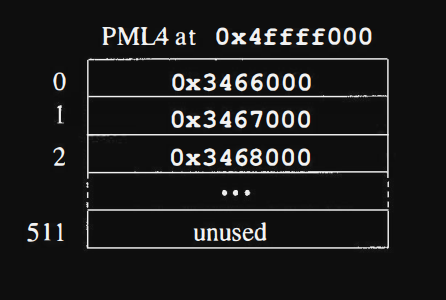
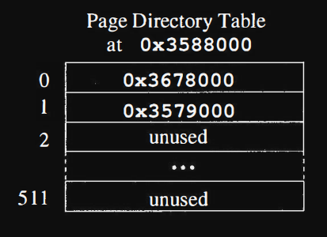
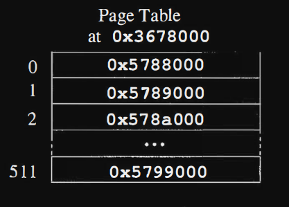

# Memory Mapping Register (64 bit mode)

we discuss the details of how virtual addresses are translated to physical addresses in the x86-64 architecture. Some of the data for translation is stored in the CPU and some of it is stored in memory

if you want to learn about multi-level paging system click [here](./multi-level_paging_system.md)

and if you want to learn about registers then click [here](./../registers/Readme.md)

---

Well the CPU designers named this register `Control Register 3` or just `CR3`. A simplified view of CR3 is that it is a pointer to the top level of a hierarchical collection of tables in memory which define the translation from virtual addresses (the addresses your program sees) to physical addresses. The CPU retains quite a few page translations internally,

but let's consider first how the CPU starts all this translation process.
Somewhere in the kernel of the operating system, an initial hierarchy
of the translation tables is prepared and CR3 is filled with the address
of the top level table in the hierarchy. This table is given the illustrious
name `Page Map Level 4` or `PML4`. When the CPU is switched to using
memory mapping on the next memory reference it starts by using CR3
to fetch the address of PML4. Surely it must retain PML4's address for
future use.

When the CPU "switches" to using memory mapping, it means that the operating system is switching the current process’s address space. This typically happens during a **context switch**, where the CPU starts using a new process's page table to translate virtual addresses to physical addresses.

In simpler terms:

1. The CPU uses **CR3** to store the **physical address** of the **PML4** (the top-level page table) for the currently active process.
2. When a context switch occurs, the operating system loads the **CR3** register with the new process's PML4 address.
3. The CPU then starts using the new **PML4** to translate virtual addresses to physical memory for the new process.

This switch ensures that the CPU accesses the correct memory for the new process, maintaining isolation between processes.

and also when the operating system switches between processes, it loads the Page Directory (and the rest of the page table hierarchy) for the new process into the MMU, ensuring that the virtual memory is correctly mapped to the physical memory for that specific process.

but Before the Page Directory (or any part of the page table hierarchy) can be used for the new process, the CR3 register must be set first.

A virtual address can be broken into fields like this:

---

Here we see that a virtual or logical address is broken into 6 fields. The
top-most 16 bits are ignored. They are supposed to be a sign extension
of bit 47, but they are not part of the address translation.(due to canonical adressing)

Following the unused bits are four 9 bit fields which undergo translation and finally a
12 bit page offset.

The result of the translation process will be a physical
address like Ox7fffff008000 which is combined with the offset let's say
it was OxlfO to yield a physical address of Ox7fffff0081f0.

Pages of memory are 2^12 = 4096 bytes, so the 12 bit offset makes sense. What about those 9 bit fields?
you can store 512 addresses in a page and 512 = 2^9 , so 9 bit fields allow
storing each of the 4 types of mapping tables in a page of memory

Bits `47-39` of a virtual address as used as an index into the `PML4` table.
The PML4 table is essentially an array of 512 pointers. These pointers
point to pages of memory, so the rightmost 12 bits of each pointer can be
used for other purposes like indicating whether an entry is valid or not.
Generally not all entries in the PML4 will be valid.

Let's suppose that CR3 has the physical address Ox4ffff000 (of PML4). Then
let's suppose that bits 47-39 of our sample address are Ox001, then we
would have an array in memory at Ox4ffff000 and we would access the
second entry (index 1) to get the address of a page directory pointer table

- Ox3467000.

## Page Directory Pointer Table

The third level in the memory translation hierarchy is the collection of
page directory tables. Each of these tables is also an array of 512 pointers,
which point to page tables. Let's assume that our sample address has the
value OxOOO for bits 29-21. Then the computer will fetch the first entry of
the page directory table to lead next to a page table at address Ox3678000.

## Page Table

The fourth and last level in the memory translation hierarchy is the collection of page tables. Again each of these tables is an array of 512 pointers to pages. Let's assume that our sample address has the value Ox1ff for
bits 20-12. Then the computer will fetch the last entry of the page table to lead next to a page at address Ox5799000.

After using 4 tables we reach the address of the page of memory which
was originally referenced. Then we can or in the page offset (bits 1 1-0) of
the original - say Oxfa8. This yields a final physical address of Ox5799fa8.

