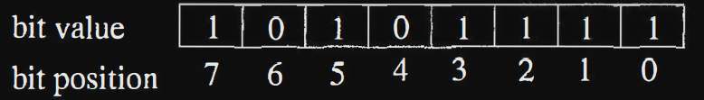
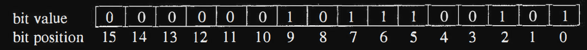
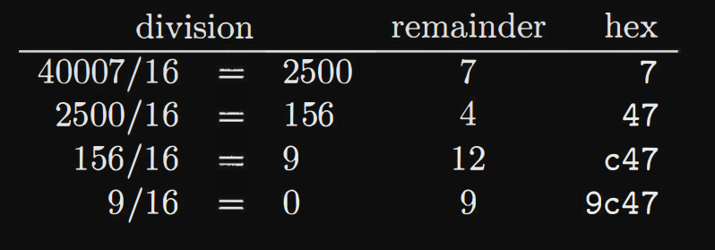
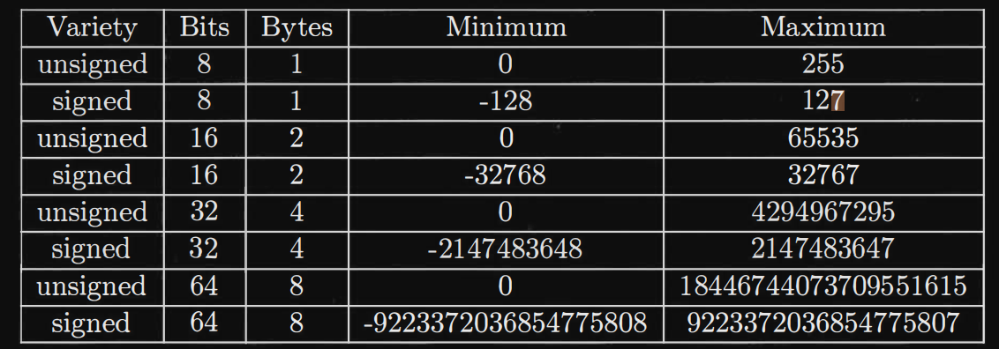
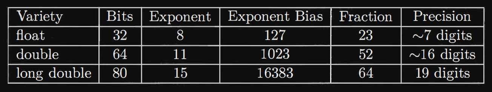
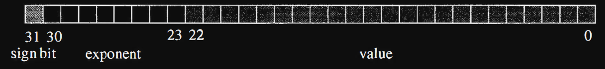

# Numbers

All information in a computer is stored as collections of bits. These bits
can be interpreted in a variety of ways as numbers. In this chapter we
will discuss binary numbers, hexadecimal numbers, integers and floating
point numbers.

- ## Binary numbers

We are used to representing numbers in the decimal place-value system.
In this representation, a number like 1234 means 1 _ 10^3 + 2_ 10^2 +3\* 10 +4.
Similarly binary numbers are represented in a place-value system using 0
and 1 as the "digits" and powers of 2 rather than powers of 10.
Let's consider the binary number 10101111. This is an 8 bit number
so the highest power of 2 is 2^7
. So this number is

```bash
10101111 = 2^7 + 2^5 + 2^3 + 2^2 + 2 + 1
= 128 + 32 + 8 + 4 + 2 + 1
= 175
```

0 will be ignored

The bits of an 8 bit number are numbered from 0 to 7 with 0 being the
least significant bit and 7 being the most significant bit. The number
175 has its bits defined below.



The conversion from binary to decimal is straightforward. It takes a
little more ingenuity to convert from decimal to binary. Let's examine the number 741.
The highest power of 2 less than (or equal to) 741 is
2^9 = 512. So we have

```bash
741 = 512 + 229
= 2^9 + 229
```

Now we need to work on 229. The highest power of 2 less than 229 is
2^7 = 128. So we now have

```bash
741 = 512 + 128 + 101
= 2^9 + 2^7 + 101
```

The process continues with 101. The highest power of 2 less than 101
is 2^6 = 64. So we get

```bash
741 = 512 + 128 + 64 + 37
= 2^9 + 2^7 + 2^6 + 37
```

Next we can find that 37 is greater than 25 = 32, so

```bash
7 41 = 512 + 128 + 64 + 32 + 5
= 2^9 + 2^7 + 2^6 + 2^5 + 5
```

Working on the 5 we see that

```bash
741 = 512 + 128 + 64 + 32 + 4 + 1
= 2^9 + 2^7 + 2^6 + 2^5 + 2^2 + 1
= 1011100101
```

Below is 741 expressed as a 16 bit integer.



An alternative method for converting a decimal number to binary is
by repeated division by 2. At each step, the remainder yields the next
higher bit.

Let's convert 741 again.


A binary constant can be represented in the NASM by appending "b" to the end of a string of O's and 1 's. So we could represent
741 as 1011100101b.

---

- ## HEXADECIMAL NUMBERS

Binary numbers are a fairly effective way of representing a string of bits,
but they can get pretty tedious if the string is long. In a 64 bit computer
it is fairly common to work with 64 bit integers. Entering a number as
64 bits followed by a "b" would be tough. Decimal numbers are a much
more compact representation, but it is not immediately apparent what
bits are O's and 1's in a decimal number.

A hexadecimal number is a number in base 16. So we need "digits"
from 0 to 15. The digits from 0-9 are just like in decimal. The digits
from 10-15 are represented by the letters 'A' through 'F'. We can also
use lower case letters. Fortunately both yasm/nasm and C/C++ represent hexadecimal numbers using the prefix Ox. You could probably use OX but
the lower case x tends to make the numbers more visually obvious.

```bash
Oxala = 10 * 16^2 + 1 * 16 + 10
= 10 * 256 + 16 + 10
= 2586
```

Converting a decimal number to hexadecimal follows a pattern like the
one used before for binary numbers except that we have to find the highest
power of 16 and divide by that number to get the correct "digit". Let's
convert 40007 to hexadecimal. The first power of 16 to use is 16^3 = 4096.
40007/4096 = 9 with a remainder of 3143, so we have

```bash
40007 = 9 * 16^3 + 3143
```

3143/16^2 = 3143/256 = 12 with a remainder of 71, so we get

```bash
40007 = 9 * 16^3 + 12 * 162 + 71
```

71/16 = 4 with a remainder of 7, so the final result is

```bash
40007 = 9 * 16^3 + 12 * 16^2 + 4 * 16 + 7 = Ox9c47
```

As with conversion to binary we can perform repeated division and
build the number by keeping the remainders.



Converting back and forth between decimal and binary or decimal
and hexadecimal is a bit painful. Computers can do that quite handily,
but why would you want to convert from decimal to hexadecimal? If
you are entering a value in the assembler, simply enter it in the form
which matches your interpretation. If you're looking at the number 1027
and need to use it in your program, enter it as a decimal number. If you
want to represent some pattern of bits in the computer, then your choices
are binary and hexadecimal. Binary is pretty obvious to use, but only
for fairly short binary strings. Hexadecimal is more practical for longer
binary strings.

Consult the table below to convert between binary and
hexadecimal.


Let's now consider converting Ox1a5b to binary. 1 = 0001, a = 1010,
5 = 0101 and b = 1011, so we get

```bash
Ox1a5b = 0001 1010 0101 1011 = 0001101001011011b
```


- ## Integers 

On the x86-64 architecture integers can be 1 byte, 2 bytes, 4 bytes, or 8
bytes in length. Furthermore for each length the numbers can be either
signed or unsigned: Below is a table listing minimum and maximum
values for each type of integer.




The range of 64 bit integers is large enough for most needs. Of course
there are exceptions, like 20! = 51090942171709440000.
Unsigned integers are precisely the binary numbers discussed earlier.
Signed integers are stored in a useful format called "two's complement".
The first bit of a signed integer is the sign bit. If the sign bit is 0, the
number is positive. If the sign bit is 1, the number is negative. The most
obvious way to store negative numbers would be to use the remaining
bits to store the absolute value of the number. 

Let's consider 8 bit signed integers and what we would get if we used
the existing circuitry to add 2 such integers. Let's add -1 and 1. Well, if
we store -1 with a sign bit and then the value we would get 

```bash
-1 =   1000 0001
 1 =   0000 0001 
---------------
-1+1 = 1000 0002 
```

Oops! We end up with -2 rather than 0.


Let's try storing 8 bit numbers as a sign bit and invert the bits for
the absolute value part of the number: 

```bash
-1 =   1111 1110
1  =   0000 0001 
-----------------
-1+1 = 1111 1111 
```
Now this is interesting: the result is actually -0, rather than 0. This
sounds somewhat hopeful. Let's try a different pair of numbers: 


Too bad! It was close. What we need it to add one to the complemented
absolute value for the number. This is referred to as "two's complement"
arithmetic. It works out well using the same circuitry as for unsigned
numbers and is mainly a matter of interpretation.
So let's convert -1 to its two's complement format. 

-1 :  1 for the sign bit
      0000001 for the absolute value
      1111110 for the complement
      1111111 after adding 1 to the complement

-1 = 11111111 after prefixing the sign bit 


so lets add this 

```bash
-1 =   1111 1111  #2's compliment
1  =   0000 0001 
-----------------
-1+1 = 10000 0000 
```

but we will ignore the 1 as it will automatically overflow
so we will get `0000 0000` which is the right answer


- ## Floating point numbers

The x86-64 architecture supports 3 different varieties of floating point
numbers: 32 bit, 64 bit and 80 bit numbers. These numbers are stored in
IEEE 754 format. Below are the pertinent characteristics of these types:



The IEEE format treats these different length numbers in the same
way, but with different lengths for the fields. In each format the highest
order bit is the sign bit. A negative number has its sign bit set to 1 and
the remaining bits are just like the corresponding positive number. Each
number has a binary exponent and a fraction. We will focus on the float
type to reduce the number of bits involved. 




The exponent for a float is an 8 bit field. To allow large numbers or
small numbers to be stored, the exponent is interpreted as positive or
negative. The actual exponent is the value of the 8 bit field minus 127.
127 is the "exponent bias" for 32 bit floating point numbers

For 64-bit floating point numbers (also known as double precision in IEEE 754 format), the exponent bias is 1023.

but for the sake of simplicity we will be working with 32 bit


