# Malware Analysis (AnyRun::cource)

This is an markdown file just to follow up with the any run cource

What is Malware Analysis?
Let's dive into the world of malware analysis with an introductory discussion about what it is and how it can be used.

In This Lesson

- ### Definition of malware analysis
- ### The benefits of malware analysis
- ### Types of malware analysis
- ### Stages of malware analysis

---

<br>
<br>

# Definition of Malware Analysis

Malware analysis involves examining a potential malware sample to understand its type, functions, and the risks it poses.

Researchers conduct this analysis to gain crucial threat intelligence, respond to cybersecurity incidents, and enhance a company’s defenses.

### Benefits of Malware Analysis

Imagine a corporate computer infected with new malware, like ransomware. If the malware spreads across the network, it could lead to significant financial losses or loss of vital data.

Security researchers aim to

- ### identify the type of malware
- ### understand its operation
- ### assess the potential damage
- ### detect network and host indicators

The analysis helps answer key questions:

- ## What does the malware do?
- ## How can it be detected on the network?
- ## How to assess and minimize the damage?
- ## How to prevent future attacks?

In some cases, you might need additional information from external sources. For instance, extracting network and host indicators and searching them in external systems can provide more indicators of compromise and insights into the malware’s behavior that might not be evident from your sample alone.

---

<br>
<br>

# Types of Malware Analysis

- ### Static analysis

  Static analysis examines a suspicious file without executing it, offering insights that help create static signatures. For example, by analyzing code, researchers might find IP addresses and URLs pointing to a malware control server. Static analysis can also identify the file type and calculate a hash sum, useful for signature creation. However, its limitations include the risk of being misled by obfuscated code, a common technique in advanced malware.

- ### Dynamic analysis

  Dynamic analysis involves running malware samples in a controlled environment to observe the processes triggered in the system. Tools like Process Monitor and Process Explorer are commonly used. To safely perform dynamic analysis, it’s crucial to use a virtual machine, ensuring the malware doesn’t cause real damage

- ### Interactive analysis

  Interactive analysis is a more advanced form of dynamic analysis, allowing researchers to control the malware’s execution and respond to it in real time. This method offers the most realistic simulation, letting analysts interact with pop-ups or modify OS configurations during the process. It’s particularly useful when dealing with sophisticated malware, like banking Trojans, which only activate under specific conditions.

  All these actions are difficult to implement using automated analysis tools.

---

<br>
<br>

# Stages of Malware Analysis

Malware analysis can be broken down into several stages. Sometimes, only a few steps are needed, but using all of them provides the most comprehensive understanding.

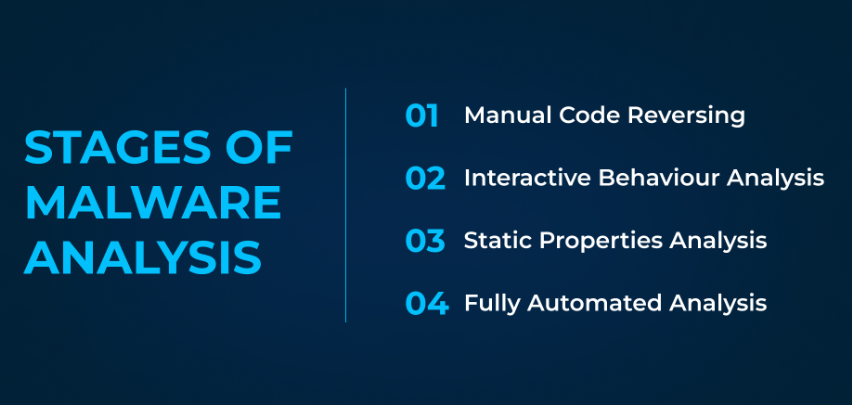

- ### Reverse code Analysis

  This advanced stage involves reverse engineering the binary file to understand its workings. It requires specialized skills and tools like disassemblers and debuggers. While some might skip this step due to its complexity, it often reveals critical insights into the malware.

- ### Interactive Behavioral analysis

  The suspicious file is executed in a controlled lab environment to observe its behavior. Analysts monitor in real-time how the malware interacts with external hosts, launches processes, and creates tasks, providing a detailed log of the program’s activities.

- ### static property analysis

  This stage involves examining static properties like strings, encoded data fragments, or compiled code sequences. The goal is to find malicious patterns, which can later become indicators of compromise.

- ### fully automated analysis

  This method quickly identifies malware by using automated systems to detect its presence. Although it’s fast, the depth of analysis is limited compared to expert reviews.

### Lesson Summary

- Malware Analysis is the process of examining a malware sample.
- There are three main types: static, dynamic, and interactive.
- Malware analysis enables you to:
- investigate security incidents
- understand the malware’s mechanisms
- obtain Indicators of Compromise (IOC)

---

<br>
<br>

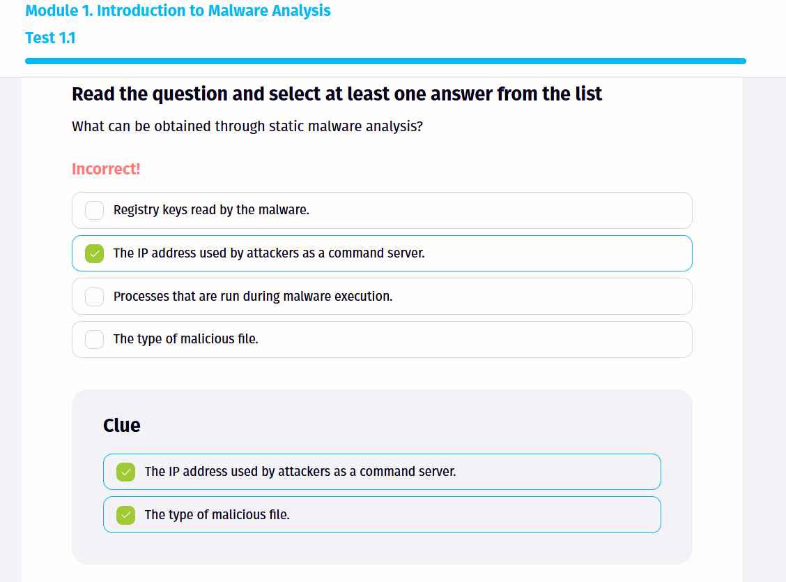

## oops my bad for sucking at this !!

<br>
<br>

# Types of Malware

The object of Malware Analysis is malware. There are many options for what it can be, and the number of options is increasing every day. And IS industry specialists have a need to share knowledge/data, and work with reports and tools that target specific classes of malware. This requires a classification or naming system. In the lesson, we will consider two approaches: the historical naming of the malware and the classification that we believe reflects the current situation with the malware well. Let's go!

In This Lesson

- ### CARO naming scheme
- ### The most popular malware families and modern classification

---

<br>
<br>

# CARO Naming Scheme

Let's start with the CARO (Computer Antivirus Research Organization) naming system/schema for malware samples. It is simple, easy to understand and is the basis for many modern classifications.

So, the scheme is built as follows:

```
[<type>://][<platform>/]<family>[.<group>][.<length>].<variant>[<modifiers>][!<comment>]
```

| **Field**                         | **Description**                                                                                                                                           |
| --------------------------------- | --------------------------------------------------------------------------------------------------------------------------------------------------------- |
| **Malware type**                  | virus, dropper, trojan, dialer, backdoor, exploit, tool, garbage                                                                                          |
| **Platform**                      | ~~V97M - macro for Office 97, Win32 - Windows 32-bit executable subsystem~~<br>**Win64 - Windows 64-bit executable subsystem**                            |
| **A family with a specific name** | (Foo ...) or a specific class-family (HLLC - High Level Language Companion Virus, HLLO - High Level Language Overwriter Virus ...)                        |
| **Group**                         | a common short name for similar malware samples in a group, but distinct from others in a family                                                          |
| **Length**                        | contains a decimal number for the length of the viral body or infecting code (depending on the type of malware)                                           |
| **Variant**                       | an even narrower division (family and group are common, but there may be some minor differences in code, etc.)                                            |
| **Modifiers**                     | data for maximum specification of threat characteristics/attributes (locale/country: De, Ru), minor specification of functional features                  |
| **Comment**                       | everything that was not included in the previous parts of the name and can specify any details that are useful for classification, threat reporting, etc. |

lets see an example

```
//example
Email-Worm.Win32/Netsky.bc.25@MM!Packed
```

This scheme was published and used for some time by vendors, laboratories, and researchers, but it never became a unified standard for decades. Instead, individual IS companies, antivirus vendors, research laboratories, and individual experts/groups of experts began to use their own or other (borrowed) malware naming schemes, and there is still no single standard.

---

<br>
<br>

# Most Popular Malware Families and Modern Classification

Here we will present one of the variants of the modern threat naming and classification scheme. It no longer contains comments (in the name) or lengths for objective reasons.

For example:

Programs that infect executable files have practically disappeared. The lengths of the files themselves and the infecting code are also no longer significant characteristics (files range from a few hundred bytes to hundreds of megabytes or more). Also, malware has since grown to the point where there is simply no way to manually describe all the individual characteristics in naming.

Why?

- Old viruses used to change other files — modern malware doesn’t usually do that.
- Malware today can be tiny or huge, so file size isn’t a useful clue.
- There are too many new threats, so names need to be short and clear.

> [!NOTE]
>
> About 50% of modern malware are Trojans because they don’t need to infect files, reducing the chance of detection.  
> Trojans appear as legitimate software, making users more likely to run them.  
> They are easier to distribute via emails, fake downloads, or malicious websites.  
> Unlike viruses, Trojans avoid triggering antivirus by not modifying existing files.  
> Their versatility makes them ideal for spying, stealing data, or installing more malware.

It should be noted that about 50% of modern malware belongs to one or another subtype of Trojans. This is due to both the lack of the need to infect files (which would lead to an active triggering of defenses) and the convenience of their distribution and effectiveness.

```
Email-Worm.Win32/Netsky.bc.25@MM!Packed
```

In modern naming, this would likely be shortened to:

```
Worm.Netsky.bc
```

Why? Because:

- We skip long technical details like how many emails it sends.
- We don't mention packing or exact platform unless necessary.
- The name just needs to give a clear idea of what it is and where it belongs

---

<br>
<br>

So, the main types of malware:

- ## virus

  Virus - classic file malware that most often infects other executable objects/programs. Virtually uncommon nowadays. Examples: older ones (Jerusalem, OneHalf). More modern (2000-2010/2015): Sality, Virut.

- ## Worms

  Worms - malicious programs that spread independently over computer networks. Most often they exploited various vulnerabilities in protocols, network services code, and other OS/network components for distribution. Examples: older ones (ILoveYou, MsBlast, Sasser). More modern (2000-2018): Conficker, WannaCry (is a hybrid of a worm and an encryption trojan).

- ## Rootkits and Bootkits

  Rootkits and Bootkits – malicious programs that in most cases have several purposes: by performing low-level access to the operating system, they intercept system calls and modify certain system structures in the operating system. Usually, this is done to hide the presence of other malware or to gain a low-level, hard-to-detect foothold in the system. Such programs are difficult to detect and even harder to remove from the system. Examples: TDL-TDL3 (classic rootkits), TDL-4 (classic bootkit), MosaicRegressor (UEFI bootkit), BlackLotus (UEFI bootkit).

- ## Adware

  Adware - malicious program that displays annoying advertisements. These ads can slow down the Internet connection, slow down computer performance, distract the user, and bring profits to advertisers and program creators through the intrusive display of ads. Examples: there are a huge number of them (OpenCandy, Superfish, Vonteera). And these are only 3 examples out of thousands.

- ## Trojans

  The vast majority of malicious programs today are various classes/subclasses of Trojans. In one way or another, a Trojan/Trojan program is a type of malware that infiltrates a computer under the guise of legitimate software and performs a variety of malicious/undesirable actions without the user's knowledge.

---

<br>
<br>
<br>

# Classification of Trojan programs

| **Category**                             | **General Description**                                                                                      | **Example Trojan** | **Description**                                                                      |
| ---------------------------------------- | ------------------------------------------------------------------------------------------------------------ | ------------------ | ------------------------------------------------------------------------------------ |
| **Remote Administration Trojans (RATs)** | Give attackers full control over the infected device remotely.                                               | **RemcosRAT**      | Provides remote access and control over the victim's machine.                        |
|                                          |                                                                                                              | **Gh0st RAT**      | Used on Windows; involved in high-profile attacks on sensitive networks.             |
| **Banking Trojans**                      | Designed to steal financial information such as logins, credit card details, and online banking credentials. | **Gameover ZeuS**  | Steals bank data; part of a botnet for large-scale financial theft.                  |
|                                          |                                                                                                              | **Dridex**         | Long-running banking malware responsible for major financial losses.                 |
| **Stealers**                             | Specialized in collecting sensitive data like passwords, keystrokes, and personal info from the system.      | **Formbook**       | Steals passwords, keystrokes, and screenshots.                                       |
|                                          |                                                                                                              | **RedLine**        | Collects sensitive data from browsers, software, and systems.                        |
| **Loaders**                              | These trojans install and run other malware on the infected machine.                                         | **BazarLoader**    | Loads and launches more dangerous malware like ransomware.                           |
|                                          |                                                                                                              | **Guloader**       | Evades analysis and delivers various malware, including RATs.                        |
| **Trojan Encoder / Ransomware**          | Encrypts files and demands payment (ransom) to restore access to the victim’s data.                          | **Ryuk**           | Encrypts user files and demands ransom.                                              |
|                                          |                                                                                                              | **Cerber**         | Known for stealthy encryption and evading antivirus tools.                           |
| **Wipers**                               | Permanently destroy data on storage devices, including hard drives and system files.                         | **Shamoon**        | Destroys the disk’s MBR using direct access.                                         |
|                                          |                                                                                                              | **StoneDrill**     | Similar to Shamoon, but doesn't use drivers; more aggressive against security tools. |
| **Keyloggers**                           | Capture keystrokes typed by the user to steal credentials and other private data.                            | **HawKeye**        | A keylogger active since 2013, monitored by IBM X-Force.                             |
|                                          |                                                                                                              | **404 Keylogger**  | Subscription-based keylogger with extensive features.                                |
| **Miners**                               | Illegally use system resources (CPU, GPU) to mine cryptocurrency without the user's knowledge.               | **Coinminer**      | Mines cryptocurrency using victim’s CPU/RAM.                                         |
|                                          |                                                                                                              | **XMRig**          | Legitimate miner often repurposed for silent illegal mining.                         |

---

<br>

You can read more about the most popular malware families on the ANY.RUN [Malware Trends Tracker](https://any.run/malware-trends/) portal. Here is a ranking of the most popular malware programs and their description.

> [!NOTE]
>
> Multifunctionality and hybrid threats: the future lies in combinations
> The trend today is to blur the lines between different classes of malware. Attackers are creating hybrid threats that combine different types of functionality. For example, a Trojan Encoder can spread like a worm (WannaCry), while a stealer can steal passwords and mine cryptocurrency.

Conclusion

- Malware programs are constantly changing, so their classifications and types are constantly being updated.
- About 50% of modern malware belong to one or another subtype of Trojans.
- As part of the course, we will work with various types of malware (for example, stealers, file-free malware, ransomware) and in general, the tools given in the course will work to detect all of these classes.

---

<br>
<br>
<br>

# ANY.RUN: A Handy Tool for Malware Analysis

In this course, we’ll explore various Malware Analysis tools, including `IDA Free`, `Detect It Easy`, `Procmon`, `Process Hacker`, and `ANY.RUN`. We’ll kick things off with an introduction to ANY.RUN, an interactive sandbox that lets you safely run suspicious files and observe how they interact with the system. The insights you gain from ANY.RUN can either be used directly or serve as a foundation for deeper analysis.

The tools we will be using are as under

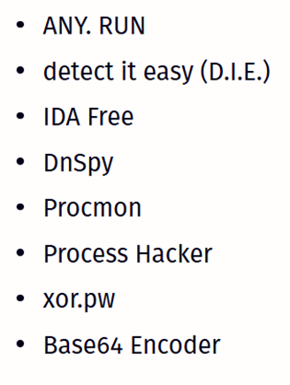

---

In This Lesson

- What is ANY.RUN
- Overview of the service interface
- Setting up a virtual machine for malware analysis
- Conducting malware analysis using ANY.RUN
- Working with public reports in ANY.RUN

# What is ANY.RUN

ANY.RUN is an interactive online sandbox designed for in-depth analysis of files and URLs in a safe, isolated environment.

- ### Dynamic analysis

  You can upload files or URLs for real-time analysis, tracking changes in the file system, registry, and other elements of the operating system.

- ### Intractive Mode

  While analysing, you can interact with the virtual machine, launch programs, open files, type text, and click on interface elements, providing a hands-on approach to code analysis.

- ### Selection of differnt OS

  Choose from various operating systems, like different versions of Windows or Linux, for your analysis.

- ### Network Analysis

  Monitor network activity, including DNS requests, HTTP traffic, and connections to remote servers.

- ### Analysis Report

  Receive detailed reports on file behaviour, network activity, system changes, and more.

- ### Attribution

  ANY.RUN not only detects program activity but also identifies the threat, determining its type, often down to the family level.

---

<br>
<br>

Who Can Benefit from ANY.RUN?

ANY.RUN is a powerful and versatile tool useful for:

- Security Researchers
  Analysing and understanding new threats.
- SOC Analysts
  Investigating and responding to security incidents.
- System Administrators
  Checking the security of files and URLs before using them on a corporate network.
- Software Developers
  Testing the security of their own applications.
- Experienced Users
  Getting information about the activities of a file in the system.
- IS Students and Trainees
  Learning from real-world cases and developing hands-on skills.

---

## Exploring ANY.RUN’s Main Menu

After logging in, you’ll see ANY.RUN's main interface. Here's a quick guide:

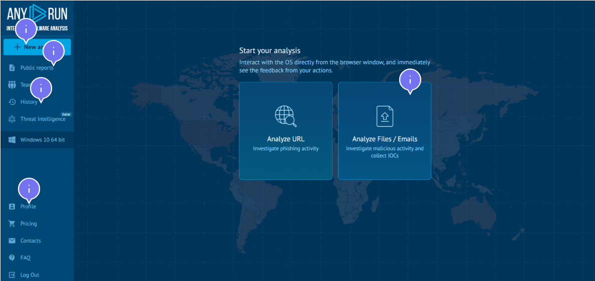

## Setting Up an Analysis Task

[click](https://youtu.be/vc2zUcUX6BE) here to set up your first task

---

<br>
<br>

There are two basic ways to configure a virtual machine in ANY.RUN:

## Simple Mode (Default) vs Professional Mode

| **Simple mode (default)**                                                                                                                                                                                                                                           | **Professional mode**                                                                                                                                                                                                                                                                                                                                                                                                                                                                                                                                                                                                                                                                                                                                                              |
| ------------------------------------------------------------------------------------------------------------------------------------------------------------------------------------------------------------------------------------------------------------------- | ---------------------------------------------------------------------------------------------------------------------------------------------------------------------------------------------------------------------------------------------------------------------------------------------------------------------------------------------------------------------------------------------------------------------------------------------------------------------------------------------------------------------------------------------------------------------------------------------------------------------------------------------------------------------------------------------------------------------------------------------------------------------------------- |
| This is the “plug and play” option where you can: <br> • Upload a file by selecting it from the file system or by dragging and dropping it. <br> • Send a link for analysis. <br> • Select an operating system. <br> • Specify the bit size of the operating system | Click on “Pro mode” to access advanced settings. In pro mode, you will see a toggle for “New Virtual Machine Video Streaming”. <br><br> This feature improves the responsiveness and frame rate of the virtual machine. <br><br> Use the drop-down menus to: <br> • Select the start directory. <br> • Select the default browser for link analysis: Chrome, Firefox, Opera or Internet Explorer. <br><br> Add a CMD command to customize the startup behavior. You can enter your own command or choose from the preset ones. <br><br> The "Change extension to a valid one" option is important for processing files with a missing or invalid extension. Enabling this option allows the system to automatically change the extension, ensuring that the file starts correctly. |

---

<br>
<br>

> [!NOTE]
>
> Note that the results of your analyses will appear in the public reports by default during training.

Use the slider to set a runtime limit for your virtual machine. This feature controls how long your virtual machine will be active. The maximum time is 20 minutes. Keep in mind that some malware programs “sleep” for a while before starting their actions. This is to avoid detection of their malicious activity in the sandbox. Therefore, if the malware does not work as you expected, try to increase/extend the analysis time.

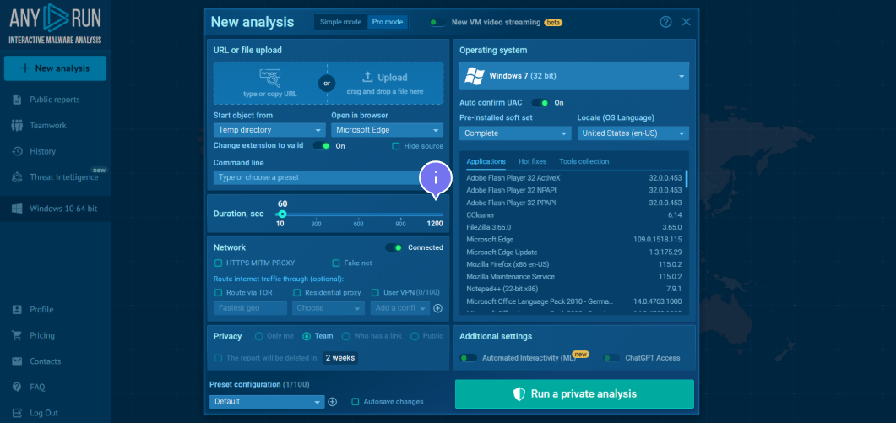

---

<br>

Analyzing network traffic is a very important feature in ANY.RUN and using these options can also improve your research:

- MITM Proxy: This tool intercepts traffic coming in and out of the sandbox. Use it to analyze encrypted HTTPS traffic.
- Fake Net: Simulates an Internet environment without actually connecting to the network, which is useful for certain types of analysis.
- Additional Security: For added security, you have the option to route traffic through TOR or a custom VPN configuration.
- VPN Configuration: You can create and manage your own VPN configuration presets
- Resident Proxy: This feature allows you to control the geographical location of your IP address. It also masks the commercial nature of the virtual machine, making your connection to command and control servers look like an infected user.

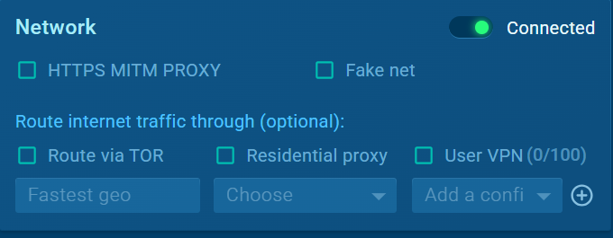

---

## Setting Up a Virtual Machine

One of the key benefits of ANY.RUN is the ability to quickly analyze a sample across multiple machine configurations.

## Providing AI Access for AI-generated Reports

In ANY.RUN, granting AI access allows you to create AI-generated reports that summarize analysis or focus on specific events, such as network activity, with files, registry and synchronization and display a summary/report of program activity

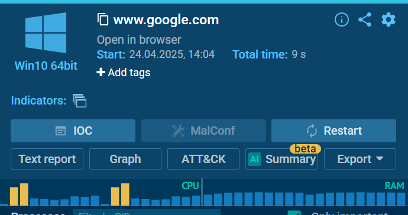

---

## Exploring the Processes

Next, let's take a closer look at the processes that the sandbox analyzes.

You can learn more about a process if you open additional process details. Click on the process.

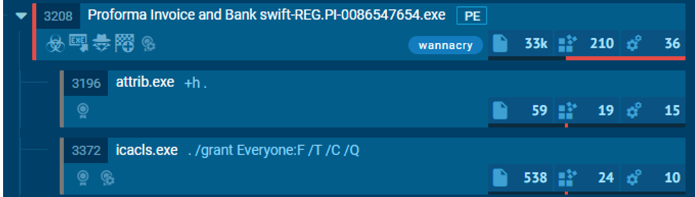

Push the "More Info" button in the "Process details" section.

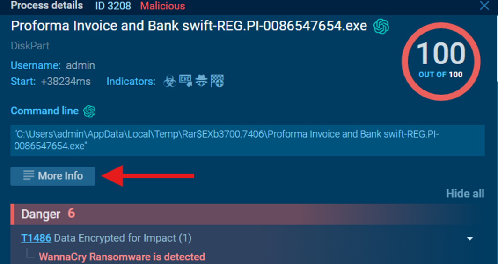

Learn more information about the process. Here, you will see the events in the system.

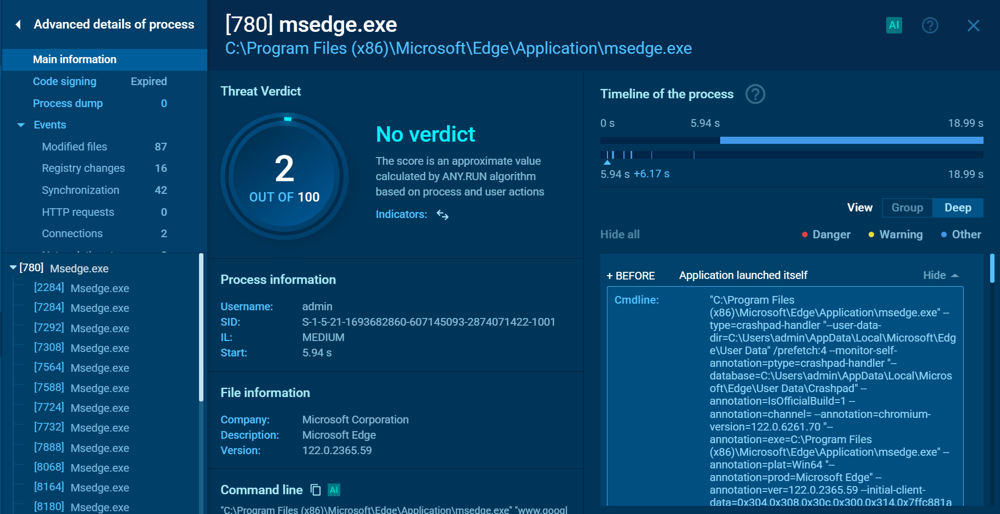

- Modified files
- Changes in the registry
- Synchronization objects
- HTTP requests (if any)
- Network connections
- Network threats
- Loaded modules
- Debugging information
- And commandline (i.e. what command line arguments the program was run with)

As a result of the analysis, the file will be given a verdict on a 100-point scale. The higher the value, the more likely it is that the file is a malware. Here you will also see the behavioral signatures that were triggered:

🔴 The red signature is an indication that it is most likely malicious activity.

🟡 The yellow one is suspicious behavior. These signatures can be found in malicious files as well as in normal programs. But they should be treated carefully.

🔵 Blue signatures are informational. They are more likely to generally notify you of general program activity. They are less likely to be suspicious (i.e. blue signatures can appear on both normal and malicious files anyway).

---

## ANY.RUN Public Reports

As mentioned above, ANY.RUN has a section with public reports.

When you click on the Public Submissions button, you will be presented with a huge pool of reports that are available for you to explore.

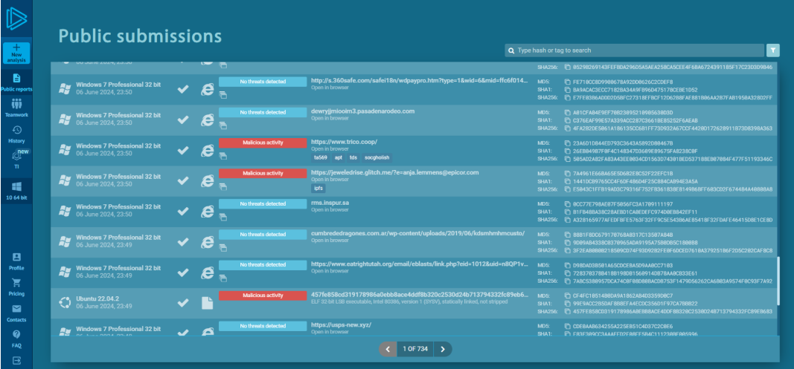

There are also built-in filtering features. By clicking on the funnel icon on the top right you can filter reports by the following parameters:

- File hash
- Type: File or URL
- File extension/type
- Country
- Verdict: malicious, suspicious or clean
- #Tag (for example: "AgentTesla")
- Domain
- IP address
- Technician ID by MITRE ATT&CK
- SID Suricata-rules
- Date range (from and to)

<br>

Conclusion

- ANY.RUN is an interactive sandbox that allows you to safely run suspicious files and study their interaction with the system.
- When creating a new analysis task, you can customize the executable environment as you wish using a large number of settings.
- The analysis results contain various artifacts that the analyst can examine independently, as well as verdicts from ANY.RUN, regarding the maliciousness of the software and its type.
- ANY.RUN's public reports are a useful tool for security professionals. They help you save time, learn from your colleagues, and stay up-to-date on new threats. The main thing is to be critical of the information and check it from different sources.

---

<br>
<br>

# Malware Static Analysis

## Analysis of the headers of portable executable files (PE) and their resources

This module is dedicated to malware static analysis. This means that in the coming lessons you will get acquainted with the analysis of the source code, understand the functions and libraries used by malware. Let's start the discussion by analyzing the headers of portable executable files.

In this lesson

- Executable files and their structure
- Headers and their resources analysis

## PE files and their structure

PE (Portable Executable) is a standard executable file format used in Windows operating systems. During the first part of the lesson, we will deal with the structure of the PE file, analyze the main headers and fields, and then analyze their meaning in the malware static analysis.

The PE file is organized as a sequence of headers and sections. The headers contain metadata about the file, such as the file type, creation time, target architecture, and entry points, while the sections contain the actual code, data, and program resources.

The main components of the PE file are as follows:

- ## DOS Header (Image DOS Header)

  - The **DOS Header** is the first part of a Windows `.exe` file.
  - It always starts with the signature `"MZ"`.
  - It has a pointer (`e_lfanew`) that shows where the real **PE header** starts.
  - Old DOS systems used it to show messages like "This program cannot be run in DOS mode."
  - Today, it mainly exists for **backward compatibility** and to locate the PE structure.

---

- ## PE Header (Image NT Headers)

  - The **PE Header** starts where the DOS Header’s pointer (`e_lfanew`) points.
  - It begins with the signature `"PE\0\0"`.
  - It defines that the file is a Windows executable (`.exe`, `.dll`, etc.).
  - It contains info like CPU type (x86, x64), sections, and characteristics.
  - Windows uses it to know **how to load and run** the program.

---

- ## Optional Header (Image Optional Header)

  - The **Optional Header** comes right after the PE Header.
  - It is **not actually optional** — it’s required for executables.
  - It stores details like **image size**, **entry point address**, and **memory layout**.
  - It also includes **OS version requirements** and **subsystem info** (like console or GUI app).
  - Windows reads this to understand **how to load the program into memory**.

---

- ## Section Tables (Image Section Headers)

  - The **Section Table** comes right after the Optional Header.
  - Each **section** (like `.text`, `.data`, `.rdata`) has its own entry.
  - It stores the **name**, **size**, **location in file and memory**, and **permissions** (read/write/execute).
  - Sections organize code, data, resources, and other parts of the executable.
  - Windows uses this to **map sections correctly into memory** when loading the program.

---

- ## Sections (Sections)

  - **Sections** are the parts of a PE file that hold actual **content** like code and data.
  - Common sections include `.text` (program code), `.data` (variables), and `.rdata` (read-only data).
  - Other sections like `.rsrc` store **resources** (icons, dialogs, images).
  - Each section is described by a **Section Header** (name, size, permissions).
  - Windows loads these sections into memory to **run the program properly**.

---

<br>

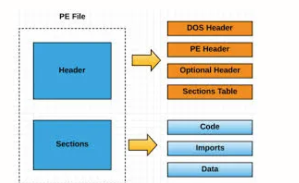

<br>
<br>

# Analysis of PE file headers

- ## DOS Header (Image DOS Header)

  - e_magic: Contains magic number "MZ" (4D 5A), identifying the file as a DOS executable
  - e_lfanew: Pointer to the beginning of the PE header

---

- ## PE Header (Image NT Headers)

  ### 1. Signature

  - Contains the signature `PE\0\0` (`50 45 00 00` in hex).
  - Identifies the file as a **PE (Portable Executable)** format.

  ***

  ### 2. File Header (`IMAGE_FILE_HEADER`)

  - **Machine**: Specifies the target processor architecture (e.g., x86, x64).
  - **NumberOfSections**: How many sections the PE file contains.
  - **TimeDateStamp**: Timestamp when the file was created.
  - **Characteristics**: Flags describing file attributes (e.g., executable, DLL, system file).

  ***

  ### 3. Optional Header (`IMAGE_OPTIONAL_HEADER`)

  - **Magic**: Indicates the Windows subsystem (e.g., 32-bit or 64-bit executable).
  - **AddressOfEntryPoint**: Memory address where program execution starts.
  - **ImageBase**: Preferred memory address for loading the executable.
  - **SectionAlignment**: Alignment of sections in memory.
  - **FileAlignment**: Alignment of sections on disk.
  - **SizeOfImage**: Total size of the loaded image in memory.
  - **DataDirectory**: Array pointing to important tables (Import, Export, Resource, etc.).

---

- ## Section Tables (Image Section Headers)

  Each entry in the partition table describes one section of the PE file and contains the following fields:

  - Name: Section name (for example, .text, .data).
  - Virtual Address: The address of the beginning of the section in memory after loading the image.
  - Size Of Raw Data: Section size in the file.
  - Pointer To Raw Data: Offset of the section from the beginning of the file.
  - Characteristics: Flags that define the characteristics of the section (for example, whether the section contains executable code, data, or resources; access rights to the section).

---

- ## import and export (tables)

  import and export tables. These tables define how the PE file interacts with other modules, such as system DLLs. Import and export analysis provides valuable information about the program's functions and helps security researchers to identify malicious behaviour.

---

<br>
<br>
<br>

# Import: connecting external functions

When a program needs to use functions from external DLLs (like `kernel32.dll` or `user32.dll`), it lists them in something called the **Import Table** inside the PE file. The Import Table contains entries called **IMAGE_IMPORT_DESCRIPTOR**, which describe each DLL the program wants to use. Each descriptor points to two important lists: the **Import Name Table (INT)** and the **Import Address Table (IAT)**. The INT holds the **names** of the functions (like `WriteFile` or `ExitProcess`), while the IAT is filled at runtime with the **actual memory addresses** where these functions are loaded. This system allows the program to call external functions easily without copying them into the program itself.

> [!NOTE]
>
> The importance of import analysis for malware analysis
> • Identification of functions: Import analysis enables to determine which functions the program uses from external libraries. For example, importing CreateProcessA from kernel32.dll may indicate the possibility of running other programs, which is typical for malware.
>
> • Identifying dependencies: Helps to determine which DLL libraries the malware depends on.
>
> • Detecting suspicious libraries: The presence of non-standard or little-known DLL files in the import may be a sign of malware.

---

<br>
<br>

# Export: providing functions to other modules

Unlike import, export is used to provide functionality to other programs or modules. DLL libraries often use exports to make their functions available to other applications.Export Table in the PE file contains a list of functions that the program makes available to other modules.

Export table structure:

- IMAGE_EXPORT_DIRECTORY: A structure describing the exported functions.
- Export Address Table (EAT): A package containing the addresses of exported functions.
- Export Name Table (ENT): A package containing the names of exported functions.
- Export Ordinal Table: A package linking the ordinal numbers of functions to their addresses in EAT.

> [!NOTE]
>
> The importance of export analysis for malware analysis
> • Understanding the functionality of DLL: Analyzing DLL export makes it possible to determine what functions it provides to other modules, that helps to understand its purpose.
>
> • Detection of "export stubs": Malware can use fake exported functions to make analysis difficult or get round detection mechanisms.

---

<br>
<br>

# Static malware analysis using the PE file structure

Analyzing the structure of a PE file is an important step in static malware analysis.

What can be learned from the headers of the PE file:

- File type and architecture
  Determine whether the file is an executable, a DLL library, or an object file. Find out the architecture for which the file is compiled.
- Compilation time
  Determine the time of file creation, that can be useful for matching with other artifacts.
- Entry point
  Find out the address where code execution starts.
- Libraries used
  To analyze the import table to find out what DLL libraries the program uses. This may indicate the functions used by the malware.
- Exported functions
  To analyze the export table to find out what functions the program provides to other modules.
- The presence of suspicious sections
  To detect unusual sections or sections with unusual access rights.
- Availability of packers
  To determine whether a file has been packed by analyzing the size of the code and other characteristics.

### Conclusion

- The PE file is organized as a sequence of headers and sections. The headers contain metadata about the file, such as the file type, creation time, target architecture, and entry points, while the sections contain the actual code, data, and program resources.
- The interaction of PE files with other modules is carried out using export and import tables.
- Thanks to the analysis of the PE file structure, you can find out the file type, executable libraries, exported functions and much more.

---

## Test

solve it

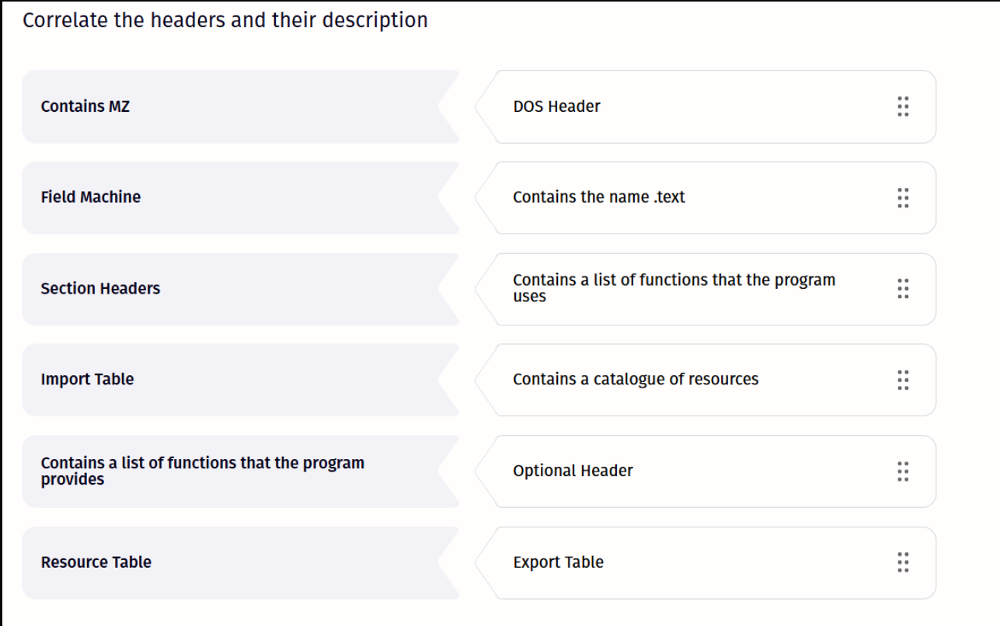

Here’s the correct matching for your question:

| Left Side                                                  | Correct Match                                          |
| :--------------------------------------------------------- | :----------------------------------------------------- |
| **Contains MZ**                                            | **DOS Header**                                         |
| **Field Machine**                                          | **Optional Header**                                    |
| **Section Headers**                                        | **Contains the name .text**                            |
| **Import Table**                                           | **Contains a list of functions that the program uses** |
| **Contains a list of functions that the program provides** | **Export Table**                                       |
| **Resource Table**                                         | **Contains a catalogue of resources**                  |

---

<br>
<br>

> [!NOTE]
> The term **“Machine”** here refers to the **Machine field** in the **PE File Header** (`IMAGE_FILE_HEADER`).
> It’s a 2-byte value that tells Windows **which CPU architecture** this binary was built for.
>
> For example:
>
> - `0x014C` = Intel 386 (`IMAGE_FILE_MACHINE_I386`)
> - `0x8664` = x64 (`IMAGE_FILE_MACHINE_AMD64`)
> - `0x01C0` = ARM (`IMAGE_FILE_MACHINE_ARM`)
>
> When the loader sees this field, it knows whether it can run the executable on the current processor—or if it must refuse to load it.

<br>
<br>
<br>

---

# Line, entropy, and hash analysis

Static analysis is the first line of defense in malware research. It enables the analysts to look inside the code without running it and identify suspicious artifacts. We will look at three key concepts of static analysis: lines, entropy and hashes, and let's look at how they help to expose malicious software.

In this lesson

- Lines in executable files and their meaning
- Entropy in executable files
- Hashing in executable files

# Lines and their values

Lines are sequences of printable characters that can contain URLs, IP addresses, file names, error messages, encryption keys, and other artifacts that show the developer's intentions.

The meaning of lines in malware analysis:

- Identification of malicious behaviour: The lines may reveal malware features, for example, "ransomware_encrypted.txt", "steal_passwords.dll" or "connect_to_c2_server".

- Network activity detection: The lines often contain domains, IP addresses, and ports used by malware to communicate with command servers or distribute to other devices.

- Obfuscation methods analysis: Malevolent intruders often encrypt or obfuscate the lines to hide malicious behaviour. Analysis of line obfuscation methods can help in deobfuscation and further analysis.

---

<br>
<br>

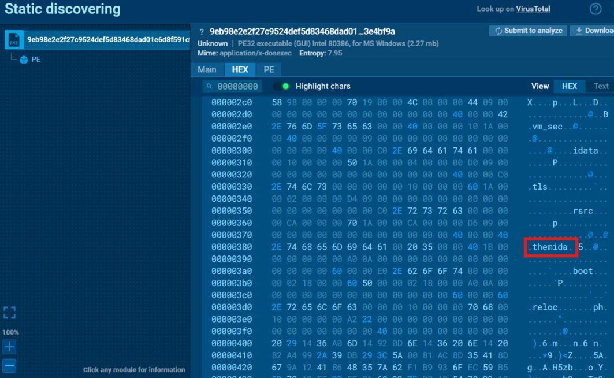

<br>
<br>

## Demo examples of malicious lines in a PE file

- ## Network interations

  1.  http://malicious.site/: URL address that potentially points to a malicious resource.

  2.  192.168.1.1:6667: IP address and port that can be used for remote access and management.

  3.  GET /botnet/commands.php: HTTP request specific to botnet agents.

  4.  User-Agent: Mozilla/5.0 (compatible; BadBot/1.0): A suspicious User-Agent imitating a legitimate browser.

---

- ## working with files and processes

  1. C:\Windows\System32\drivers\evil.sys: The path to the file in the system directory, which may indicate an attempt to hide malware.

  2. taskkill /f /im explorer.exe: A command to terminate the Windows Explorer process, used to destabilize the system or hide activity.

  3. .exe, .dll, .sys: Executable file extensions frequently used by malware.

<br>

> [!NOTE]
> The .sys extension is used for System files in Windows.
> Specifically, a .sys file is usually a driver or a low-level system component.

---

- ## Data theft & keylogger

  1. login, password, credit card, cvv: Sensitive data, the presence of which in the lines may indicate malicious intentions

---

- ## system manipulations

  1.  HKCU\Software\Microsoft\Windows\CurrentVersion\Run: The registry key used for program autoloading.

  2.  net user /add hackeradminThe command to create a new user account.

  3.  netstat -an | findstr :445: The command to check open ports, used to search for vulnerable systems.

---

- ## communication with the user

  1. Your computer is infected!: A typical shareware message aimed at intimidating the user.

  2. Send $100 to this Bitcoin address…: Ransom demand, typical for ransomware.

---

<br>

> [!NOTE]
> This list is not exhaustive.
> The presence of such lines is not always an unambiguous proof of harmfulness, but it serves as a signal for a more thorough analysis.

---

<br>
<br>
<br>

# Entropy

Entropy in the context of malware analysis measures the degree of randomness or disorder of data in a file. The higher the entropy is, the more the file looks like random noise, which may indicate compression, encryption, or code obfuscation.

The value of entropy in malware analysis:

- Detection of packers and cryptors: Packaged or encrypted files usually have high entropy because the data is compressed or encrypted to reduce the size and hide the contents.

- Identification of suspicious sections: Sections of a PE file containing malicious code or data may have a higher entropy than regular sections (the high entropy of the code section (.text) may indicate the presence of obfuscated or encrypted code).

- Analysis prioritization: Files with high entropy may indicate more complex or advanced threats that require more in-depth analysis.Add text

Entropy in the context of PE files shows the degree of data randomness. For example, a file with the repeated text `AAAAA` has a low entropy, and a file with a random set of characters `S)7a#x` has a high entropy.

---

<br>

Range of values:

Low entropy (0-4): Usually uncompressed and unencrypted data.
Average entropy (4-7): Can be both legitimate and suspicious.
High entropy (7-8): Often indicates compression, encryption, or obfuscation.

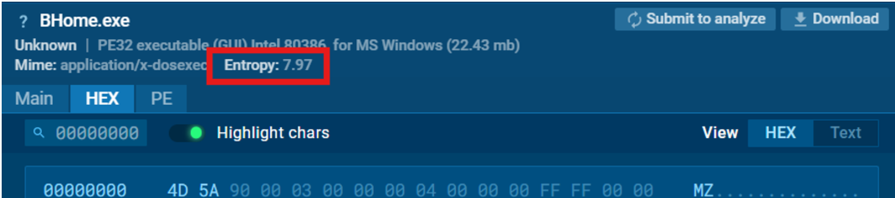

---

> [!NOTE]
>
> Entropy is just an indicator.
> High entropy on its own does not mean that the file is malicious, but it serves as a signal for closer analysis.

---

<br>
<br>

you can also cheack the entropy using many tools such as

- PEiD
- Detect It Easy (DIE)
- Binwalk
- CFF Explorer
- Exeinfo PE
- pestudio
- HxD (hex editor with manual entropy analysis)

---

<br>
<br>

# Hash marks: digital fingerprints

Hashing is the process of converting data of arbitrary size into a unique fixed-length value called a hash mark. Hash marks are used to verify the integrity of files and identify known threats. If you know the hash mark of the file, you can search for it in Google, in public repositories or in public sandboxes.

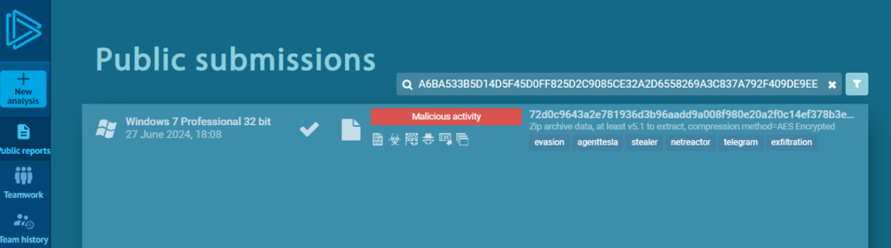

The influence of hash marks in malware analysis

- ### Identification of known threats

  Hash marks of malicious files are added to threat databases (for example, VirusTotal), enabling you to quickly determine whether a file has previously been identified as malicious.

- ### Search for similar files

  Hash analysis allows to find similar files that may be variants or modifications of already known threats.

- ### Tracking the spread of threats

  Hash marks help to track how a particular malware is widespread and identify its sources.

---

<br>
<br>

Examples of hashing algorithms with values

```bash
MD5: 349d6af6f1710decfcb42a6a6ce1c15e
SHA-1: 817e215be884c50e0e115e106fd41fc9d5224359
SHA-256: 1ce17200496c6ffbbfe6220fa147f7599edce5a4dfb27a0afe14e072ceca5eb6
```

but the Malware often changes itself (this is called polymorphism or metamorphism) to defeat hash-based detection.

So here’s how it works in real-world malware analysis:

- Simple Hash Matching works only when the malware does not change itself.

- Polymorphic Malware modifies its code slightly each time (e.g., by adding junk instructions, renaming variables) — so its hash changes every time.

### solution

- Analysts don't rely only on full-file hashes.

- They use fuzzy hashing (like ssdeep) — which can detect files that are similar, even if not exactly the same.

- They also look at behavior (what the file does), file structure, strings, imported functions, etc.

- Advanced detection uses machine learning and behavior analysis instead of only hashes.

---

if you are looking for fuzzing tools here are some of the most famous tools

- ssdeep — Most famous tool for fuzzy hashing (supports comparing files and directories).

- sdhash — Scalable, faster fuzzy hashing, good for very large datasets. [click](http://roussev.net/sdhash/tutorial/sdhash-tutorial.html) here to learn more

- TLSH (Trend Micro Locality Sensitive Hashing) — Another modern fuzzy hashing algorithm, good for malware similarity detection.

- Hashdeep — Can calculate both normal and fuzzy hashes (ssdeep) in one tool.

- pydeep — Python bindings for ssdeep (good if you want to automate fuzzy hashing).

---

<br>
<br>

### Conclusion

Lines, entropy, and hashes are powerful tools in the malware analyst's arsenal. They provide information about the functionality, harmfulness of files, and their relationship to other threats.

---

<br>
<br>
<br>

# Encryption

## Introduction to encryption

In the world of cybersecurity, encryption plays a binary role. On the one hand, it is a reliable shield to protect confidential data. On the other hand, it is a tool in hackers’ hands that allows them to hide malicious activity and bypass protective mechanisms. That is why understanding the principles of encryption is so important to analyze and neutralize malware.

In this lesson

- How malware uses encryption
- Symmetric VS asymmetric ciphers
- Stream VS block ciphers
- Algorithm categorization

---

<br>
<br>

## How malware uses encryption

Encryption is the process of converting information into an unreadable format, understandable only to those who have a special key to decrypt it. Imagine that malicious code is a secret message that hackers want to send to your computer. Encryption is invisible ink that makes this code incomprehensible to security software and to an analyst.

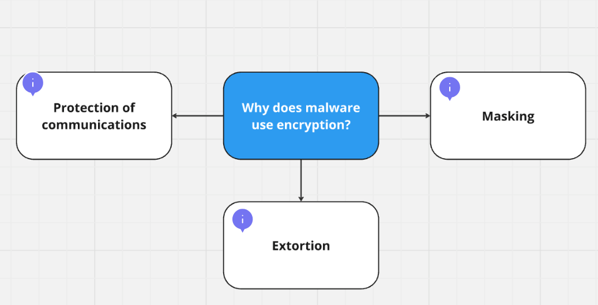

---

## Encryption types: symmetric vs. asymmetric

There are two main types of encryption used to secure data:

### Symmetric Encryption

Symmetric encryption algorithms use **the same secret key** for both encryption and decryption.  
Both the sender and the receiver must possess the same key and keep it confidential.

- **Examples:**

  - **AES** (Advanced Encryption Standard) — widely used for securing data at rest and in transit.
  - **DES** (Data Encryption Standard) — now considered insecure due to small key size.
  - **3DES** (Triple DES) — improvement over DES, encrypts three times for extra security.
  - **RC4** — stream cipher, now largely deprecated due to weaknesses.

- **Advantages:**

  - **Fast and efficient** — suitable for encrypting large amounts of data.
  - **Low computational overhead** — ideal for resource-constrained devices.

- **Disadvantages:**
  - **Key distribution problem** — securely sharing the secret key over an insecure channel is difficult.
  - **Scalability issues** — as the number of users increases, key management becomes more complex.

---

### Asymmetric Encryption

Asymmetric encryption, also called **public-key cryptography**, uses **two mathematically linked keys**:

- A **public key** (shared openly) to encrypt data.
- A **private key** (kept secret) to decrypt data.

- **Examples:**

  - **RSA** (Rivest–Shamir–Adleman) — one of the first public-key algorithms, widely used for secure data transmission.
  - **ECC** (Elliptic Curve Cryptography) — newer, uses smaller keys for similar security levels, ideal for mobile devices.
  - **DSA** (Digital Signature Algorithm) — mainly used for digital signatures, not encryption directly.

- **Advantages:**

  - **Secure key exchange** — no need to share private keys.
  - **Enables digital signatures** — providing authentication, integrity, and non-repudiation.

- **Disadvantages:**
  - **Slower than symmetric encryption** — higher computational load.
  - **Not ideal for encrypting large datasets** — typically used to encrypt a symmetric key instead.

---

### Summary Table:

| Feature        | Symmetric Encryption                   | Asymmetric Encryption                   |
| -------------- | -------------------------------------- | --------------------------------------- |
| Keys           | Same key for encryption and decryption | Public key and private key (different)  |
| Speed          | Very fast                              | Slower                                  |
| Key Management | Difficult                              | Easier                                  |
| Use Case       | Encrypting large volumes of data       | Secure key exchange, digital signatures |
| Examples       | AES, DES, RC4                          | RSA, ECC, DSA                           |

---

<br>
<br>

# Stream and Block Ciphers: Two Approaches to Data Protection

Besides being divided into **symmetric** and **asymmetric** encryption, encryption algorithms are also categorized based on **how they process information**:

---

### Stream Ciphers

Think of stream ciphers like water flowing through a pipe, purified drop by drop.  
Stream ciphers **encrypt data bit-by-bit or byte-by-byte**, continuously, as it moves through the system.

- **Advantages (+):**

  - **High speed** — ideal for real-time applications like voice and video calls.
  - **Low memory and CPU requirements** — good for resource-limited environments (IoT, mobile devices).
  - **Suitable for streaming data** — such as live video, audio, or VoIP.

- **Disadvantages (–):**

  - **Key reuse vulnerability** — reusing a key can expose patterns and weaken security (e.g., RC4 weakness).
  - **Error propagation** — a small error in transmission can corrupt the rest of the decrypted stream.
  - **Weaker against some types of attacks** if poorly implemented.

- **Examples:**
  - **RC4** — widely used in the past (e.g., early SSL/TLS), now considered insecure.
  - **Salsa20 / ChaCha20** — modern, secure stream ciphers used in new protocols like TLS 1.3 and Google services.
  - **SEAL** — designed for high-speed software encryption.

---

### Block Ciphers

Block ciphers work more like stacking bricks.  
They **divide data into fixed-size blocks** (commonly 64 or 128 bits) and encrypt each block separately, often with various "modes of operation" to enhance security.

- **Advantages (+):**

  - **Strong security guarantees** — resistant to many attack types (chosen plaintext, ciphertext-only attacks).
  - **Error tolerance** — errors affect only one block (depending on the mode used).
  - **Flexible operation** — different block cipher modes (e.g., CBC, GCM) allow trade-offs between security, error handling, and performance.

- **Disadvantages (–):**

  - **Padding overhead** — if data doesn't perfectly fit the block size, extra padding is needed, adding complexity.
  - **Performance** — less efficient for very small or real-time data unless optimized carefully.

- **Examples:**
  - **AES** (Advanced Encryption Standard) — the current global standard for data encryption.
  - **DES** (Data Encryption Standard) — historical importance, but insecure today.
  - **Blowfish** — fast, still used in some applications.
  - **Twofish** — a successor to Blowfish, strong candidate during AES competition.

---

### Additional Concept: Block Cipher Modes of Operation

Because block ciphers natively work on one block at a time, **modes of operation** are used to make them handle larger or streaming data securely:

| Mode                        | Description                                                           | Example Use                     |
| --------------------------- | --------------------------------------------------------------------- | ------------------------------- |
| ECB (Electronic Codebook)   | Encrypts each block independently (not recommended, exposes patterns) | Toy examples, legacy systems    |
| CBC (Cipher Block Chaining) | Each block is XORed with the previous encrypted block                 | Secure file storage             |
| CFB (Cipher Feedback)       | Turns a block cipher into a stream cipher                             | Streaming data                  |
| OFB (Output Feedback)       | Also turns a block cipher into a stream cipher                        | Secure communications           |
| GCM (Galois/Counter Mode)   | Provides encryption and authentication together                       | TLS 1.3, VPNs, secure messaging |

---

### Quick Comparison:

| Feature         | Stream Cipher                         | Block Cipher                    |
| --------------- | ------------------------------------- | ------------------------------- |
| Data processing | Bit-by-bit or byte-by-byte            | Block-by-block (e.g., 128 bits) |
| Speed           | Very high                             | Moderate to high                |
| Error Impact    | May spread over data                  | Often limited to one block      |
| Common uses     | Real-time communication, live streams | File encryption, secure storage |
| Examples        | RC4, ChaCha20                         | AES, DES, Blowfish              |

---

<br>
<br>

# Categorization of algorithms
