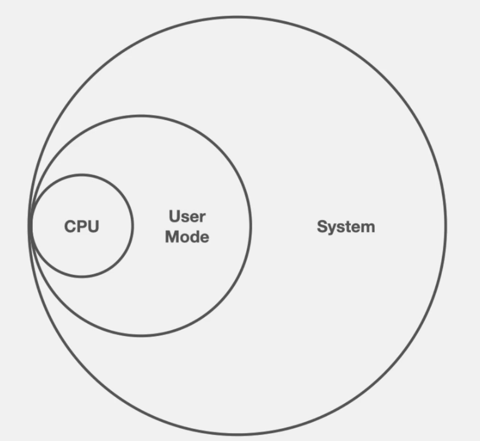
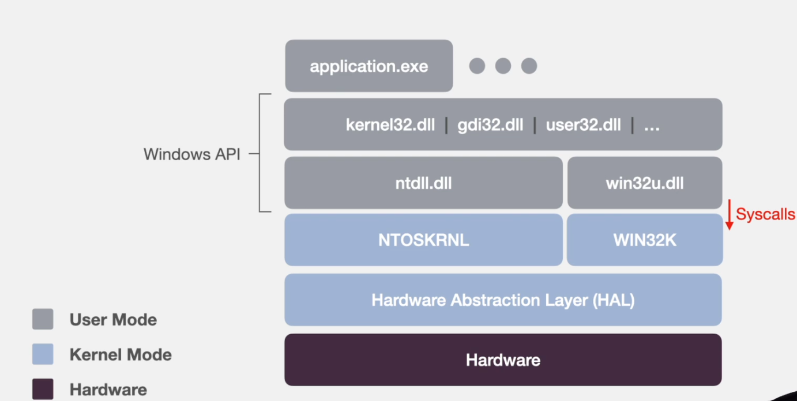

# **What is Emulation?**

**Emulation** is a technique that enables one computer system (the _host_) to imitate the behavior of another computer system (the _guest_). The goal of emulation is to **replicate the original hardware or software environment** so that programs designed for the guest system can run unmodified on the host system.

---

## **Key Characteristics of Emulation**

1. **System Imitation**
   Emulation replicates not just the software environment but also the **hardware architecture** of the guest system — including CPU instruction sets, memory layout, I/O devices, etc.

2. **Platform Independence**
   Because it mimics the guest at a low level, emulation allows software to run **regardless of the host system’s architecture**. For example, you can run an ARM-based system on an x86 PC via an emulator.

3. **Software-Based**
   Most emulation is purely software-driven, meaning the host machine simulates the entire behavior of the guest hardware through code.

---

## **How Emulation Works (Conceptually)**

1. **Instruction Translation**
   Guest instructions (which might be for a different architecture like MIPS or ARM) are **interpreted or translated** into host instructions (like x86 or x86_64) at runtime.

2. **Device Modeling**
   Virtual versions of hardware components like timers, keyboards, graphics cards, and disks are emulated to provide the expected behavior for guest software.

3. **Memory and I/O Mapping**
   The memory layout expected by the guest system is simulated, and I/O operations are captured and routed to corresponding host functions.

---

## **Emulation vs. Virtualization**

| Feature            | Emulation                                 | Virtualization                         |
| ------------------ | ----------------------------------------- | -------------------------------------- |
| Hardware Imitation | Yes (can emulate different architectures) | No (relies on compatible architecture) |
| Performance        | Slower (due to translation overhead)      | Faster (closer to native execution)    |
| Compatibility      | High (cross-platform possible)            | Lower (must match host CPU)            |
| Use Cases          | Legacy support, testing, console games    | Server consolidation, cloud VMs        |

---

## **Use Cases of Emulation**

1. **Running Legacy Software** – Old DOS, Mac, or Windows 98 programs on modern systems.
2. **Cross-Platform Development** – Testing ARM programs on x86 machines.
3. **Reverse Engineering & Security** – Malware analysis in a safe, isolated emulated environment.
4. **Game Preservation** – Playing older games on modern hardware.
5. **Embedded System Testing** – Simulating hardware environments before physical hardware is available.

---

## **Advantages of Emulation**

- **Compatibility** with old or different systems.
- **No need for actual hardware** (useful for rare or obsolete machines).
- **Safe environment** for experimentation and testing.

---

## **Disadvantages**

- **Performance Overhead**: Emulation is generally much slower than native execution.
- **Complexity**: Accurately emulating hardware is complex and may have bugs or incomplete features.
- **Resource Intensive**: Can consume a lot of CPU/memory.

---

## **Types of Emulators**

1. **CPU Emulators(Hardware)**
   - Ghidra , Unicorn (quick emulator) can emulate different CPU architectures.
   - Emulates different cpu instructions
   - does not work with systemcalls, it is good for emulating shell code , tiny chink of code block , but when ever any code points to the system call or some thing like that you cannot emmulate it you must fake it
2. **Application Emulators(User level)**

   - run applications from one OS on another, like Wine (Windows apps on Linux) , Qiling , speakeasy & Dumpulator.
   - it is also emulating cpu instruction like cpu emulator but it also have an os specified system layer what i mean by it is that when ever the code is calling lets say kenel32.dll so the emulator has also an fake kenel32.dll with fake exports that when called the emulator will then mimic what ectually happends when you call those dll in your code

3. **Full-System Emulators(Kernel level)** – emulate an entire machine, such as old consoles or entire legacy computers (e.g., Bochs, MAME).
4. **Game Console Emulators** – emulate systems like PlayStation, NES, etc. (e.g., PCSX2, Dolphin).

---

<br>



<br>



<br>

---

now we will build a simple seven instruction emulator using the [Capstone](https://www.capstone-engine.org/) disassembly engine.

### Simple Emulator Framework

- `EIP` is our instruction pointer that will keep track of our offset in the code
- `cs` is the disassembly engine, we pass it the bytes for an instruction and it will return a instruction object
- We only need 2 registers `EAX` and `EBX` in addition to `EIP`
- Our instruction handlers only handle one variant of the instruction each
  - `mov <reg>,<imm>`
  - `add <reg>,<reg>`
- Emulation will terminate when we reach the end of the code

```python
from capstone import *
from capstone.x86 import *

CODE_FILE = 'add.bin'

# Read shellcode file
code = None
with open(CODE_FILE,'rb') as fp:
    code = fp.read()

assert code is not None

# Setup disassembly engine for x86 32-bit
cs = Cs(CS_ARCH_X86, CS_MODE_32)
cs.detail = True
cs.skipdata = True

# Create regsiters
registers = {}
registers[X86_REG_EAX] = 0
registers[X86_REG_EBX] = 0

# EIP is our instruction pointer
# Start it at the beginning of the shellcode
registers[X86_REG_EIP] = 0

# Run until we reach the end of the shellcode
while registers[X86_REG_EIP] != len(code):
    address = registers[X86_REG_EIP]

    # We don't know the instruction length so choose the maximum size (15)
    # Capstone will truncate accordingly
    instruction = next(cs.disasm(code[address:address + 15], address))
    mnemonic = instruction.mnemonic
    operands = instruction.operands

    # Debug print
    print(f"{address:#010x}:\t{instruction.mnemonic}\t{instruction.op_str}")

    # Instruction handlers (this is our emulator)
    if mnemonic == "mov":
        # mov <reg>,<imm>
        if operands[0].type == X86_OP_REG and operands[1].type == X86_OP_IMM:
            registers[operands[0].reg] = operands[1].value.imm
        else:
            print(f"\n{instruction.mnemonic} variation not implemented")
            break

    elif mnemonic == "add":
        # add <reg>,<reg>
        if operands[0].type == X86_OP_REG and operands[1].type == X86_OP_REG:
            registers[operands[0].reg] = registers[operands[0].reg] + registers[operands[1].reg]
        else:
            print(f"\n{instruction.mnemonic} variation not implemented")
            break

    else:
        # Catch unimplemented instruction and exit
        print(f"\nInstruction not implemented: {instruction.mnemonic}")
        break

    # Increment EIP to the next instruction
    registers[X86_REG_EIP] += instruction.size

print(f"\nCompleted emulation, EAX: {registers[X86_REG_EAX]}")
```

```bash
0x00000000: mov eax, 2
0x00000005: mov ebx, 3
0x0000000a: add eax, ebx

Completed emulation, EAX: 5
```

here we will learn only about 2 emulaters 

- [unicorn](./unicorn.md)
- [Qiling](./Qiling.md)
