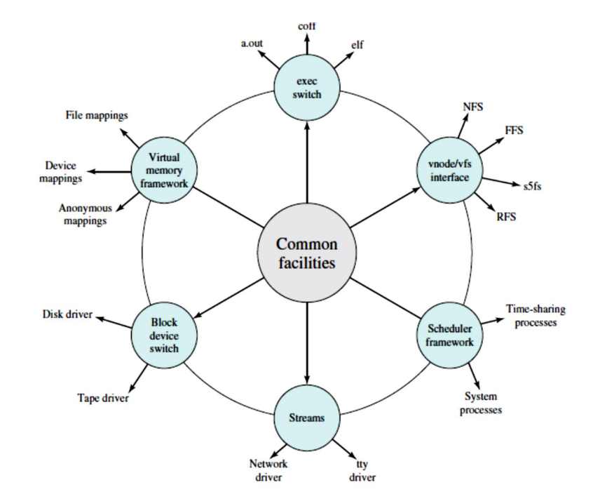

# Operating-System Structure

Modern operating systems are very **large and complex**, so they need to be **carefully planned and organized** to work properly and be easy to update or fix.

A **common method** used is to **divide the OS into smaller parts**, called **modules**, instead of making it one big chunk of code.

Each **module** handles a specific part of the system, like memory, input/output, or file management. These modules have:

- **Clear responsibilities** (what they do),
- **Well-defined boundaries** (what they don’t do), and
- **Specific ways to communicate** with each other (called interfaces).

---

### **Analogy with Writing Code**

Think about how you write your own programs:

- Instead of putting all your code inside the `main()` function,
- You create **separate functions** for different tasks,
- Each function has **input (parameters)** and **output (return values)**,
- Then you **call** these functions from `main()` to keep your program clean and organized.

The same idea is used when building an operating system—break it into clean, manageable pieces that can work together smoothly.

---

## Types of Operating System Structures

- Monolithic Structure
- Layered Approach
- Microkernels
- Modules
- Hybrid Systems
  - macOS and iOS
  - Android

---

 
 

# Monolithic Structure (tightly coupled system)

The **monolithic structure** is one of the earliest and simplest ways to design an operating system. In this structure, **the entire operating system is compiled into one large program** that runs in a **single address space**, typically in **kernel mode**. All the core functionalities are packed together without strict separation.

---

### **How It Works**

In a monolithic kernel, all major components of the operating system—like file management, memory management, device drivers, system call handling, CPU scheduling, and more—are part of **one large program**. This means:

- There’s no clear boundary between different parts of the OS.
- All components can call each other freely, which can make the system faster but also more complex to manage.

---

### **Example: UNIX**

A good example of a monolithic structure is the **original UNIX operating system**. UNIX was split into two main parts:

1. **System programs** – Utilities and tools that help users interact with the OS.
2. **The kernel** – The core of the OS that interacts with the hardware and performs essential functions.

Inside the UNIX kernel, components like the file system, CPU scheduler, and memory manager were bundled together, even though they were loosely organized into layers. This gave a feeling of structure but didn’t fully separate each part.

---

### **Modern Example: Linux**

The **Linux kernel** is also monolithic. All core parts of the OS run in **kernel mode** and **share the same memory space**. However, Linux includes some improvements over traditional monolithic systems:

- It supports **modular design**, which means new functionalities like device drivers can be **added or removed at runtime** as modules.
- Even though it’s monolithic, Linux allows more flexibility compared to the classic UNIX structure.

---

### **Advantages of Monolithic Structure**

1. **Performance**: All components share the same address space, so **inter-component communication is very fast**.
2. **Low Overhead**: There’s minimal overhead when system calls are made, because everything is in one space.
3. **Simple for small systems**: For small or simple systems, this approach can be easier to manage initially.

---

### **Disadvantages of Monolithic Structure**

1. **Hard to maintain and extend**: Since everything is tightly connected, **adding new features or fixing bugs** can be risky—one mistake might crash the whole system.
2. **Low modularity**: It's difficult to **isolate components**, test them individually, or reuse them in other systems.
3. **Security concerns**: If one part of the kernel is compromised (like a buggy driver), the **entire system becomes vulnerable**.

---

### **Why It’s Still Used**

Despite the drawbacks, monolithic kernels are still used in major operating systems like **Linux**, **UNIX**, and even **Windows** (though Windows is more of a hybrid). The main reason is **performance**—fast system call handling and internal communication make monolithic systems efficient for many use cases.

---

### **Summary**

The **monolithic structure** organizes an OS as a single large program running in one address space. It is **fast and efficient** but **difficult to modify and maintain**. Systems like **UNIX and Linux** follow this structure, although modern implementations try to make it more modular.

---

---

 
 
 

# Layered Approach

The **Layered Approach** is a way to structure an operating system so that it is organized into **multiple levels (or layers)**, each with specific and limited functionality. Instead of putting everything into one large program (as in the monolithic structure), the OS is broken down into manageable components, which improves **modularity**, **maintainability**, and **debugging**.

---

### **Why Use a Layered Approach?**

In a **monolithic kernel**, all components are tightly connected. This means a change in one part might cause unexpected problems in another. This **tight coupling** makes it hard to update or fix specific features.

To overcome this, the **layered approach promotes loose coupling**. Each part of the system (layer) is independent from the others, relying only on the functionality of the layers directly below it.

---

### **Structure of the Layers**

The layered operating system is usually organized like this:

- **Layer 0** – Hardware (CPU, memory, disk, etc.)
- **Layer 1** – Basic hardware drivers and low-level functions
- **Layer 2** – Memory management, process scheduling
- **Layer 3** – File systems, device management
- **Layer N** – User interface or system calls

Each layer interacts **only** with the layer directly below it and **provides services** to the layer directly above it. This creates a **clean and clear structure**, like a stack.

---

### **How Each Layer Works**

Each layer is like a **black box**: the layers above don’t need to know how it works internally—they just need to know **what it does**.

For example:

- A higher layer may request to read a file.
- It doesn’t need to know **how** the file system works or how the disk is accessed.
- It just uses an interface provided by the lower layer (e.g., "read_file()").

This way, **implementation details are hidden**, and developers can change or improve one layer **without breaking the others**.

---

### **Benefits of the Layered Approach**

1. **Simplicity and Clarity**

   - Each layer has a **clear role** and purpose.
   - The system is easier to understand and design.

2. **Ease of Debugging**

   - You can debug **one layer at a time**.
   - If a problem occurs in a layer, it's easier to locate because the layers below it are already tested and stable.

3. **Modularity**

   - You can **change, improve, or replace** one layer without affecting others.
   - New features can be added to specific layers without reworking the entire OS.

4. **Abstraction**
   - Each layer **abstracts** hardware or services, making it easier for upper layers to operate without dealing with complex lower-level details.

---

### **Challenges and Limitations**

While the layered approach has many benefits, it also comes with some **downsides**:

1. **Defining Layers is Difficult**

   - It’s not always clear **where one layer should end and the next should begin**.
   - Poorly designed layers can cause confusion and inefficiency.

2. **Performance Overhead**

   - A system call (e.g., reading a file) might need to go through **multiple layers**, increasing execution time.
   - Each step adds overhead, which can **slow down the system**.

3. **Rare in Pure Form**
   - Few operating systems use **a purely layered design** due to the issues above.
   - Most modern OSes (like Windows and Linux) use a **partially layered** or **hybrid** model to balance performance with modularity.

---

### **Real-World Use**

- The **TCP/IP protocol stack** in networking is a great example of a successful layered system (e.g., physical layer, data link, network, transport, application).
- Web applications often follow a layered architecture: frontend → backend → database.

Some older operating systems like **THE OS** and **Multics** were based on a strict layered model, but modern OSes have moved toward **flexible layering** with broader layers containing more functionality.

---

### **Summary**

The **Layered Approach** structures an operating system into distinct levels, each building on the functionality of the layer beneath it. This makes the OS easier to design, develop, debug, and maintain. However, careful planning is required to define the layers properly and avoid performance issues. While **pure layered systems are rare**, many modern OSes borrow ideas from this model to achieve a balance of structure and speed.

---

 
 
 

# Microkernels

Early operating systems like **UNIX** used a **monolithic structure**, where everything was packed into a single, large kernel. As UNIX systems expanded over time, the kernel became **too large and hard to manage**. To solve this problem, a new design approach was introduced called the **Microkernel Architecture**.

---

### **What is a Microkernel?**

A **microkernel** is a type of operating system architecture that **removes all nonessential components from the kernel** and implements them in **user space** as separate programs. This results in a **smaller, more manageable kernel**.

- The goal is to **keep the kernel as small as possible**.
- Only **essential functions** are kept in the kernel (like basic process management, memory management, and inter-process communication).
- Everything else—like file systems, device drivers, and networking—is moved out to **user space**, where it runs as **user-level services**.

This design is shown in typical **microkernel architecture diagrams**, where the kernel is in the center and everything else (file server, device drivers, etc.) runs outside the kernel in user space.

---

### **Key Component: Message Passing**

Since services are separated from the kernel and from each other, they need a way to **communicate**. This is handled using **message passing**.

- The **microkernel acts as a middleman**, passing messages between the client (user program) and services.
- For example, if a user program wants to open a file:
  - It **does not talk directly** to the file system.
  - Instead, it **sends a message to the kernel**, which then **relays** that message to the file server process.
  - The file server processes the request and sends a response **back through the microkernel**.

This method of communication helps with **isolation and modularity**, but it also adds some **performance overhead** (discussed later).

---

### **Advantages of Microkernel Design**

1. ### **Easier to Extend the OS**

   - New features or services can be added **without changing the kernel**.
   - These new services just run in user space.
   - This makes **development and updates safer and faster**.

2. ### **Smaller Kernel**

   - Since only essential parts are in the kernel, any updates or changes to the kernel are **minimal**.
   - Easier to **test, maintain, and debug**.

3. ### **Easier Portability**

   - Because the kernel is small and hardware-specific code is limited, it is **easier to move** (port) the operating system to **different hardware platforms** (like phones, embedded devices, or PCs).

4. ### **Better Security and Reliability**
   - If a **user-level service crashes**, the kernel and the rest of the system **are not affected**.
   - This isolation helps prevent bugs and security issues from spreading.
   - Fewer components in kernel space means **fewer risks of system-wide failures**.

---

### **Examples of Microkernel Operating Systems**

1. ### **Darwin (macOS and iOS)**

   - Darwin is the **core of Apple’s macOS and iOS**.
   - It actually uses two kernels, one of which is the Mach microkernel, and the other is the BSD kernel.

     These two are integrated into a single kernel image in macOS and iOS, forming a `hybrid kernel` that combines microkernel features (from Mach) and monolithic features (from BSD) for both modularity and performance.

     we will discous this latter on

2. ### **QNX**
   - A **real-time operating system** often used in **embedded systems**.
   - The **QNX Neutrino microkernel** handles:
     - Process scheduling
     - Message passing
     - Hardware interrupts
     - Low-level networking
   - All other services (e.g., file system, drivers) are **user-space processes**.

---

### **Disadvantages of Microkernels**

While microkernels offer many benefits, they are not without problems. The **main issue** is **performance**:

1. ### **Message Passing Overhead**

   - Since services are in **different address spaces**, communication between them requires **copying data** back and forth through the kernel.
   - Every request from one service to another needs:
     - **Multiple message copies**
     - **Process context switches** (which are expensive)

2. ### **Slower Than Monolithic Kernels**
   - The time taken to pass messages and switch between processes adds **delay**.
   - These extra steps make **microkernels slower**, especially in tasks that require lots of communication (e.g., file access, device control).

---

### **Case Study: Windows NT**

- **Windows NT** (the early version of modern Windows) originally used a **layered microkernel design**.
- However, **performance was poor** compared to **Windows 95**, which used a more monolithic structure.
- In response:
  - **Windows NT 4.0** moved some parts from **user space into the kernel** to improve speed.
- By the time **Windows XP** came out, the design was **more monolithic than microkernel**.

---

### **How macOS Deals with Microkernel Performance**

While **macOS** uses the **Mach microkernel**, Apple addressed its performance issues by:

- **Integrating more functions into the kernel** space (just like Windows NT did).
- This results in a **hybrid kernel**, which tries to balance **modularity and performance**.

---

### **Summary**

| Feature              | Microkernel                                                                                           |
| -------------------- | ----------------------------------------------------------------------------------------------------- |
| **Design**           | Minimal kernel, many services in user space                                                           |
| **Communication**    | Message passing via the microkernel                                                                   |
| **Advantages**       | Easy to extend, better security, portability, smaller kernel                                          |
| **Disadvantages**    | Slower due to message passing and context switching                                                   |
| **Examples**         | Darwin (macOS/iOS), QNX                                                                               |
| **Real-World Shift** | Systems like Windows and macOS moved towards hybrid structures to balance performance with modularity |

---

 
 
 

Sure, here's a detailed explanation of **Section 2.8.4: Modules** in easy and complete terms:

---

# Modules

Modern operating systems are large and complex. One of the best ways to design them today is to **break them down into parts** that can be **loaded and unloaded as needed**. This is known as using **Loadable Kernel Modules (LKMs)**.

### What Are Modules?

Think of modules as **plug-ins for the operating system kernel**. Instead of building one giant program that includes every feature or driver the OS might need, we keep a small "core" and allow other features to be added **on demand**.

These modules can include things like:

- Device drivers (for USB, printers, etc.)
- File system support (like FAT32, NTFS, ext4)
- Network protocols

Modules are **loaded into the kernel** either:

- **At boot time** (when the system starts), or
- **During run time** (for example, when you plug in a USB device)

---

### Why Use Modules?

Let’s say you’re developing a new file system or a new type of device driver. If the kernel was **not modular**, you would have to:

- Modify the kernel code
- Recompile the entire kernel
- Reboot your system

With modules, you can just write the module separately and **load it into the running kernel** using a tool like `insmod` (insert module) or `modprobe`. You can also **unload it** with `rmmod`.

---

### FStructure: How Is This Different From Other OS Designs?

#### Compared to Monolithic Kernels:

- Monolithic kernels are fast but not very flexible (everything is built-in).
- Module-based kernels keep the **core small** but can **dynamically grow** as needed, without rebooting.
- Linux is still monolithic in terms of structure but supports modules for flexibility.

#### Compared to Layered Systems:

- Layered systems have strict rules: higher layers only talk to lower ones.
- With modules, any part of the system can talk to any other module (not limited by layers), which makes it **more flexible**.

#### Compared to Microkernels:

- Microkernels use **message passing** for communication between components (which can be slow).
- Modules **live in the kernel’s address space**, so they don’t need message passing, making them **faster**.

---

### Example: Linux and LKMs

Linux is a great example of a modular system.

- When you plug in a USB device, Linux checks if it has the right driver.
- If not, it can **load a module on the fly** to support that device.
- Later, if the device is removed, the driver can also be **unloaded**.

This gives you:

- **Performance** (because Linux is still monolithic and fast)
- **Flexibility** (because new features can be added or removed on demand)
- **Maintainability** (because you don’t need to recompile the entire kernel)

---

### 📦 Summary

| Feature         | Modules Approach                                |
| --------------- | ----------------------------------------------- |
| **Modularity**  | Kernel is made of a core + plug-in modules      |
| **Flexibility** | Add/remove functionality during runtime         |
| **Efficiency**  | No message passing overhead like microkernels   |
| **Use Cases**   | File systems, device drivers, network protocols |
| **Popular In**  | Linux, macOS, Solaris, Windows                  |

---

if you are intrested in writing lkms click [here](https://sysprog21.github.io/lkmpg)

---

 
 
 

# Hybrid Systems

In real-world scenarios, most modern operating systems do not follow a single, strict architectural model like purely monolithic or purely microkernel. Instead, they use a **hybrid structure**, combining the strengths of multiple approaches to balance **performance, flexibility, security, and usability**.

For instance, **Linux** is considered a **monolithic kernel** because all core services run in a single address space, which makes it **highly efficient** in terms of speed. However, Linux is also **modular**, meaning it supports **loadable kernel modules** (LKMs) that allow new features like device drivers or file systems to be added without rebooting the system or recompiling the kernel. This gives Linux both the performance of a monolithic system and the flexibility of a modular one.

Similarly, **Windows** is also largely monolithic, with most core components running in kernel mode for performance. But it incorporates certain **microkernel concepts**, such as running **subsystems in user mode**, which improves security and stability. These subsystems—called **operating-system personalities**—allow Windows to support different application environments. Additionally, like Linux, Windows also supports **dynamically loadable modules**, which contribute to its flexibility.

These blended designs are what we call **hybrid systems**. They aim to avoid the strict limitations of one single architectural style while taking advantage of each approach’s strengths. In the sections that follow, this hybrid model is explored further through real-world examples like **macOS**, **iOS**, and **Android**, which are leading examples of how hybrid operating system designs are implemented today.

 
 

## macOS and iOS

**macOS and iOS** are two operating systems developed by Apple, designed for different device types—**macOS** for desktops and laptops, and **iOS** for smartphones and tablets. Despite their different hardware targets, they share much of their architecture, which is why they are often studied together. Their structure is **layered**, with each layer handling specific system responsibilities.

### 1. **User Experience Layer**

This is the topmost layer that handles the user interface:

- On **macOS**, this is called **Aqua**, designed for use with a mouse or trackpad.
- On **iOS**, the UI layer is called **Springboard**, optimized for **touch input** on mobile devices.

### 2. **Application Frameworks Layer**

This layer provides developers with **APIs** (Application Programming Interfaces) via frameworks like:

- **Cocoa** for macOS applications.
- **Cocoa Touch** for iOS applications.
  Both are built to work with **Objective-C** and **Swift**, but Cocoa Touch includes special tools to support mobile-specific features like touchscreens and sensors.

### 3. **Core Frameworks Layer**

This includes the system-level frameworks responsible for media and graphics, such as:

- **QuickTime** (for media handling),
- **OpenGL** (for 2D/3D graphics rendering).

### 4. **Kernel Environment: Darwin**

At the lowest level, macOS and iOS share a **common kernel environment** called **Darwin**. Darwin itself is a **hybrid kernel** composed of:

- The **Mach microkernel**, which provides low-level services like CPU scheduling, memory management, and interprocess communication (IPC),
- The **BSD (Berkeley Software Distribution)** kernel, which brings in the **UNIX** features, including POSIX-compliant system calls, user accounts, file systems, and more.

Applications on macOS and iOS may interact with the system through any layer. Some may go through all UI and framework layers (e.g., standard apps), while others (like a simple C program) may bypass them and talk directly to the Darwin kernel through **POSIX system calls**.

---

### Key Differences Between macOS and iOS:

- **Hardware Architecture**:
  - macOS is compiled for **Intel** (and now also Apple Silicon like M1/M2).
  - iOS is compiled for **ARM** processors (used in mobile devices).
- **System Customization and Access**:

  - **macOS** offers developers full access to **POSIX and BSD APIs**, which means more control and flexibility.
  - **iOS** is more **restricted**—developers have **limited access** to low-level system interfaces, focusing instead on app development through higher-level APIs.

- **Power and Memory Management**:
  - iOS has more **aggressive power and memory management** features to conserve battery and resources on mobile hardware.

---

### More on **Darwin** (the kernel environment):

Darwin blends the microkernel and monolithic ideas. It provides **two system-call interfaces**:

- **Mach traps** (microkernel system calls),
- **BSD system calls** (POSIX interface used by C programs).

Darwin handles system services using **kernel abstractions** such as:

- **Tasks** (processes),
- **Threads** (units of execution within tasks),
- **Ports** (used for message passing),
- **Memory objects** (for managing shared memory).

For example, if a program uses the `fork()` system call to create a new process, it's implemented by the BSD side, but internally, Darwin creates a **Mach task** to represent the process.

Darwin also includes:

- **I/O Kit** – a framework for creating device drivers.
- **Kernel Extensions (kexts)** – dynamically loadable modules for adding extra kernel functionality without rebooting.

---

### Performance Considerations

While Mach is technically a **microkernel**, Darwin avoids traditional microkernel overhead by running **all key components (Mach, BSD, I/O Kit, etc.) in a single address space**. This means message passing doesn’t require costly memory copying between separate address spaces, which improves performance. So although Darwin **uses message passing**, it keeps everything in one address space—**blending microkernel structure with monolithic performance**.

---

### Open Source and Proprietary Aspects

Apple released **Darwin** as **open source**, allowing other developers and projects to use or modify it (for example, adding support for different file systems or GUIs like X11). However, upper layers like **Cocoa**, **Aqua**, and **other proprietary frameworks** remain **closed source** and are only available for official Apple platforms.

---

### Summary

Apple's macOS and iOS operating systems combine **modular**, **microkernel**, and **monolithic** concepts in a hybrid architecture. They share a common foundation in **Darwin**, use **layered designs**, and tailor their features to suit either desktop or mobile use. Their combination of flexibility, performance, and controlled access is what defines modern Apple system architecture.

 
 

# Android

**Android** is a mobile operating system developed by the **Open Handset Alliance**, primarily led by **Google**. Unlike **iOS**, which is **closed-source** and runs only on Apple hardware, Android is **open-source** and can run on a **wide variety of devices**, which is a major reason for its widespread global adoption. Android’s architecture is **layered**, with each layer providing specific services and functionalities to support application development and execution on mobile devices.

---

### **1. Layered Structure of Android**

Like iOS, Android uses a **software stack architecture**. Here's how each layer works:

#### **A. Application Layer**

At the top are the **applications** that users interact with—like phone apps, web browsers, and games. These apps are developed by third-party developers using **Java** or **Kotlin**, and they run in their own **sandboxed environments** for security.

#### **B. Application Framework**

This layer provides high-level **framework APIs** to developers. These APIs allow access to Android system services such as:

- Activity management
- Location services
- Notifications
- Content providers
- Resource management (for UI, images, etc.)

Developers use these APIs to build rich and responsive mobile apps.

#### **C. Android Runtime (ART)**

- Apps are **written in Java** but compiled into **Dalvik Executable (.dex) files**, which are optimized for the **Android Runtime (ART)**.
- Android doesn’t use the **standard Java Virtual Machine (JVM)** or APIs. Instead, it uses its **own Android-specific APIs** and runtime.
- The ART performs **Ahead-Of-Time (AOT)** compilation. This means that instead of interpreting Java bytecode or using JIT compilation at runtime, it **compiles apps into native machine code during installation**.
  - This approach improves **performance** and **power efficiency**, which is essential for mobile devices.
- Developers can also use **JNI (Java Native Interface)** to write parts of the app in native languages like C or C++ for direct access to hardware or performance-critical tasks. However, these parts are usually **not portable** across different devices due to hardware differences.

---

### **2. Native Libraries**

Below the runtime, Android provides a set of **native C/C++ libraries**. These offer performance-efficient functionalities, such as:

- **WebKit**: Web browser engine
- **SQLite**: Lightweight database engine
- **SSL**: Secure sockets for encrypted communication
- **SurfaceManager, OpenGL/ES**: Graphics libraries for rendering

These native libraries can be used directly by the runtime or by native code written via JNI.

---

### **3. Hardware Abstraction Layer (HAL)**

The **HAL** is an intermediate layer that abstracts the **underlying hardware** from higher-level software. Each piece of hardware (like GPS, Bluetooth, camera, fingerprint scanner) has a corresponding **HAL module**.

- HAL provides a **consistent API** to the Android system, so developers and the system can interact with hardware **without knowing the hardware details**.
- This is what allows Android to run on such a **diverse set of devices** made by different manufacturers.

---

### **4. Bionic C Library**

Instead of using the typical **glibc** used in Linux systems, Android uses its own **Bionic C Library**, which is:

- **Lightweight and faster**, with a **smaller memory footprint**.
- **Optimized for mobile CPUs**, which are slower and less powerful than desktop/server CPUs.
- **Licensed differently**, allowing Google to avoid the **GPL license restrictions** of glibc, giving it more control over Android’s licensing and distribution.

---

### **5. Linux Kernel**

At the bottom of the Android stack lies a **customized Linux kernel**. Though Android is based on Linux, Google has made **significant modifications** to adapt it for mobile use:

- **Power management improvements** to extend battery life.
- **Enhanced memory management** for resource-constrained environments.
- Introduction of **Binder IPC (Inter-Process Communication)**:
  - A **new IPC mechanism** developed specifically for Android.
  - It allows processes (like apps and system services) to **communicate efficiently and securely**.
  - It's also more lightweight and faster than traditional UNIX IPC methods like pipes or message queues.

---

### **Key Differences from iOS**

| Feature                | Android                 | iOS                              |
| ---------------------- | ----------------------- | -------------------------------- |
| **Source Code**        | Open source (AOSP)      | Closed source (except Darwin)    |
| **Hardware**           | Runs on many devices    | Only Apple devices               |
| **API Access**         | More open to developers | More restricted (esp. low-level) |
| **Virtual Machine**    | Android Runtime (ART)   | None; uses compiled native code  |
| **IPC Mechanism**      | Binder                  | Mach message passing (Darwin)    |
| **Standard C Library** | Bionic                  | BSD lib + XNU (Darwin)           |

---

### **Conclusion**

Android is a highly modular, flexible, and efficient operating system optimized for mobile environments. It combines a **custom Java-like environment**, a **special runtime (ART)**, and a **lightweight C library (Bionic)** on top of a **modified Linux kernel**. Its **hardware abstraction** and **open-source nature** allow it to run on a vast range of devices, from phones and tablets to smart TVs and even embedded systems.

This layered and hybrid structure provides both **portability** and **performance**, making Android one of the most widely used operating systems in the world.

---

 
 
 
 

# wsl (WINDOWS SUBSYSTEM FOR LINUX) 1

Windows uses a **hybrid operating system architecture**, meaning it combines features of **monolithic** and **microkernel** designs. It offers **user-mode subsystems**—essentially separate environments that allow Windows to support multiple operating systems or APIs. One powerful example of this is the **Windows Subsystem for Linux (WSL)**, which was introduced in Windows 10.

---

### **What is WSL?**

WSL allows you to **run native Linux programs** on Windows **without needing a virtual machine or dual boot**. It does this by creating a **compatibility layer** within Windows that can interpret Linux system calls and translate them to Windows equivalents.

---

### **How It Works (Process Flow)**

1. **bash.exe**  
   When a user launches **`bash.exe`**, they are presented with a Linux terminal shell inside Windows. This gives the appearance and functionality of using Linux, but it's happening inside Windows.

2. **Linux Instance**  
   `bash.exe` starts a **Linux instance**, which includes an **`init` process** (the first process in any Unix-like system). The init process creates the **`/bin/bash`** process, which is the actual terminal the user interacts with.

3. **Pico Process**  
   Both `init` and `bash` run inside special Windows processes called **Pico processes**. A **Pico process** is a lightweight container designed specifically to run non-Windows binaries, like **ELF binaries** (Executable and Linkable Format, the standard format for Linux executables). These processes have their **own address space** and behave similarly to native Linux processes—but inside Windows.

4. **Linux System Call Translation**  
   When the Linux application inside the Pico process makes a **system call** (a request to the OS to perform some low-level task), that call is intercepted by two special Windows services:
   - **LXCore** (Linux Core Services)
   - **LXSS** (Linux SubSystem Services)

---

### **How Translation Happens**

There are a few scenarios here:

- **1-to-1 Mapping**:  
  If the Linux system call has a **direct equivalent** in Windows (e.g., reading a file), the system call is passed straight through to the Windows kernel.
- **Similar but Not Identical**:  
  If the Linux system call is **similar but not identical** to its Windows counterpart, **LXSS** handles part of the request using custom logic, then calls the Windows equivalent for the rest.

  - **Example**: The Linux `fork()` system call, which duplicates a process, has no exact match in Windows. Instead, `CreateProcess()` is used (though it's not identical). LXSS bridges this gap by doing some of the `fork()` logic and finishing it with `CreateProcess()`.

- **No Equivalent Exists**:  
  If there is **no Windows counterpart**, LXSS has to fully emulate the behavior in software.

---

### Summary

WSL is an ingenious system that lets Linux apps run **natively** on Windows by translating Linux system calls using **Pico processes** and services like **LXCore** and **LXSS**. While Linux and Windows differ internally, WSL bridges that gap by translating Linux behavior to the Windows kernel level. This shows the power of **hybrid architecture**—offering both compatibility and performance.

---

 
 
 

# wsl 2

**WSL 2** is the second generation of the Windows Subsystem for Linux. Unlike WSL 1, which used **system call translation**, WSL 2 runs a **real Linux kernel** in a **lightweight virtual machine (VM)**. This change gives WSL 2 much better **compatibility** with Linux applications, including full support for tools like Docker, `fork()`, and more.

WSL 2 is still tightly integrated with Windows — it **boots in seconds**, supports Windows file access, and allows seamless use of Linux apps side by side with Windows apps.

---

### **How WSL 2 Works (Architecture Explained)**

1. **Real Linux Kernel in a VM**  
   WSL 2 uses a **real Linux kernel** (custom built by Microsoft), which runs inside a **lightweight virtual machine** managed by **Hyper-V**. This kernel is **open-source** and maintained by Microsoft.

   - The use of a full kernel means **no need to translate system calls** like in WSL 1 — Linux apps run natively.

2. **Init System and Processes**  
   When you start a WSL 2 distro (e.g., Ubuntu), the Linux kernel inside the VM launches the standard **`init`** system (like in a real Linux system), which manages other Linux processes like `/bin/bash`, background services, etc.

3. **File Systems**

   - WSL 2 uses a **virtual disk file** (`ext4.vhdx`) for your Linux filesystem, which supports **ext4**, a standard Linux file system.
   - You can also access the **Windows file system from Linux** via `/mnt/c/` and **Linux files from Windows** via `\\wsl$\` network paths.

4. **Networking**  
   WSL 2 runs in its own **virtualized network environment**. That means it has its **own IP address**, like any VM, but port forwarding is handled automatically.

5. **Startup & Memory Efficiency**  
   Even though WSL 2 uses virtualization, it **does not behave like a heavy traditional VM**.

   - It's **optimized for speed**, starts almost instantly, and **only uses as much RAM as needed**.
   - It can also **shrink memory usage dynamically**, which is useful on laptops or limited-resources systems.

6. **System Call Support**  
   Since WSL 2 uses a **real kernel**, it supports **100% of Linux system calls** (e.g., `fork()`, `ioctl()`, `mount()`, etc.).  
   This is **crucial** for apps like:
   - Docker
   - compilers
   - package managers (e.g., `apt`)
   - system-level debugging tools (`strace`, `lsof`, etc.)

---

### **Docker and WSL 2**

One of the biggest advantages of WSL 2 is **full Docker support**. Because the Linux kernel supports **cgroups**, **namespaces**, and other container features, you can run Docker containers **natively** inside WSL 2 without needing Docker Desktop (after initial setup). This was **not possible** in WSL 1.

---

### Summary

WSL 2 completely changes the game from WSL 1. It replaces the syscall translation layer with a **real Linux kernel** running in a **lightweight virtual machine**. This gives full compatibility, better performance for many workloads, and support for advanced Linux features like Docker and containerization. At the same time, WSL 2 remains tightly integrated with Windows, so it feels fast and native to use.

---
