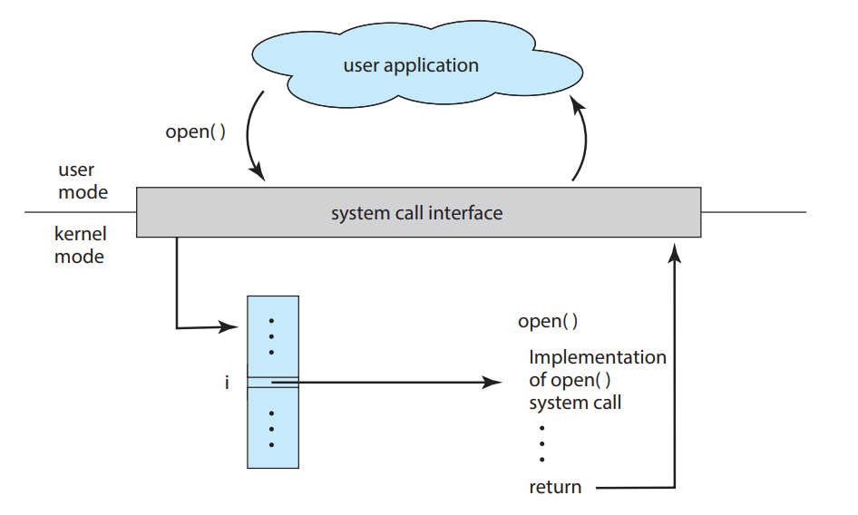

# System-call

System calls provide an interface to the services made available by an operating system. These calls are generally available as functions written in C and
C++, although certain low-level tasks (for example, tasks where hardware
must be accessed directly) may have to be written using assembly-language
instructions.

## Example

before we study about sys-calls in detail first take an look at this example

When writing a program to copy data from one file to another, multiple system calls are required for handling input/output, error checking, and termination. The sequence of operations includes:

### **1. Getting the File Names**

- The program needs to obtain the names of the input and output files.
- This can be done in different ways depending on the OS:
  - **Command-line argument**: Example in UNIX: `cp in.txt out.txt`
  - **Interactive input**: The program prompts the user to type the file names.
  - **Graphical selection**: A GUI-based system allows the user to select files from a menu.
- Each method requires system calls for writing prompts and reading user input.

### **2. Opening the Input File & Creating the Output File**

- **Opening the input file** (system call)
  - If the file does not exist or lacks read permissions, an error occurs.
  - The program must display an error message (another system call) and may terminate.
- **Creating/opening the output file** (system call)
  - If a file with the same name already exists, possible actions include:
    - Aborting the program.
    - Deleting the existing file (system call) and creating a new one.
    - Asking the user whether to overwrite (requires additional system calls).

### **3. Reading and Writing the File**

- The program enters a loop where:
  - **Reading from the input file** (system call)
    - Errors may occur (e.g., end of file reached, hardware failure).
  - **Writing to the output file** (system call)
    - Errors may occur (e.g., no disk space left).
- Each read/write operation returns a status indicating success or failure.

### **4. Closing Files and Terminating**

- Once the file is copied:
  - **Closing both files** (two system calls).
  - **Displaying a completion message** (system call).
  - **Terminating the program** (final system call).

### **Conclusion**

This example highlights how operating systems expose services through system calls. Every step—getting input, opening files, handling errors, reading/writing, and termination—relies on system calls to interact with hardware and manage resources.

---

 
 

# API

Operating systems provide numerous services to applications, such as file management, process control, and memory allocation. However, most programmers do not directly invoke **system calls** to access these services. Instead, they use an **Application Programming Interface (API)**, which provides a higher-level interface that simplifies system interactions. An API defines a set of functions that developers can use in their applications, specifying the required parameters, expected return values, and how these functions interact with the operating system. By using APIs, applications can be written in a way that is more **portable**, meaning they can run on different operating systems with minimal modifications.

### Common APIs for Different Operating Systems

There are several well-known APIs that developers use depending on the operating system they are targeting:

1. **Windows API (WinAPI)**

   - The Windows API is the primary API for Windows-based systems and is used for developing applications that interact with the Windows operating system.
   - It provides functions for **window management, file operations, process control, networking, and graphical user interfaces**.
   - The Windows API is accessed through various libraries, including:
     - **Kernel32.dll** (Core system functions like process/thread management and memory allocation)
     - **User32.dll** (Handles user interface elements like windows, menus, and input)
     - **Gdi32.dll** (Manages graphical output like rendering images and text)
     - **Advapi32.dll** (Handles security and registry access)
     - **Ws2_32.dll** (Networking support, including sockets for communication)
   - Windows programs written in **C or C++** often use these libraries to interact with system resources.

2. **POSIX API**

   - The **Portable Operating System Interface (POSIX)** API is a standard for UNIX-like operating systems, including **Linux, macOS, and BSD-based systems**.
   - It provides functions for **process management, file handling, interprocess communication (IPC), and networking**.
   - The standard C library, known as **libc**, provides access to system calls in UNIX-based systems.
   - A widely used implementation of the POSIX API on Linux is **GNU C Library (glibc)**, which provides essential functions such as:
     - `open()`, `read()`, `write()`, and `close()` for file handling
     - `fork()` and `exec()` for process creation and execution
     - `socket()` for network communication
   - Other implementations include **musl libc** (used in lightweight Linux distributions) and **BSD libc** (used in FreeBSD and macOS).

3. **Java API**
   - Unlike WinAPI or POSIX, the **Java API** is platform-independent and is designed for applications running on the **Java Virtual Machine (JVM)**.
   - It provides a vast set of libraries for **file I/O, networking, concurrency, database access, and graphical user interfaces (Swing, JavaFX)**.
   - The Java API abstracts low-level system interactions, meaning that Java applications can run on **Windows, Linux, and macOS** without modification.

---

Behind the scenes, the functions that make up an API typically invoke the
actual system calls on behalf of the application programmer. For example, the
Windows function `CreateProcess()` actually invokes the `NTCreateProcess()` system call in the
Windows kernel.

Why would an application programmer prefer programming according to
an API rather than invoking actual system calls? There are several reasons for
doing so.

### Why Use an API Instead of Direct System Calls?

APIs offer several benefits over directly making system calls:

- **Portability**: Programs written using APIs can often run on different operating systems with little to no modification.
- **Ease of Development**: APIs provide well-documented functions, making it easier for developers to write code without needing to understand complex system internals.
- **Security and Stability**: Direct system calls can lead to errors or vulnerabilities, whereas APIs provide a controlled way to access system resources safely.
- **Backward Compatibility**: Operating system vendors maintain API compatibility over different versions, reducing the risk of breaking applications when upgrading.

---

many of the POSIX and Windows APIs are similar to
the native system calls provided by the UNIX, Linux, and Windows operating
systems.

| **Category**                | **Windows System Call**          | **Unix System Call** |
| --------------------------- | -------------------------------- | -------------------- |
| **Process Control**         | `CreateProcess()`                | `fork()`             |
|                             | `ExitProcess()`                  | `exit()`             |
|                             | `WaitForSingleObject()`          | `wait()`             |
| **File Management**         | `CreateFile()`                   | `open()`             |
|                             | `ReadFile()`                     | `read()`             |
|                             | `WriteFile()`                    | `write()`            |
|                             | `CloseHandle()`                  | `close()`            |
| **Device Management**       | `SetConsoleMode()`               | `ioctl()`            |
|                             | `ReadConsole()`                  | `read()`             |
|                             | `WriteConsole()`                 | `write()`            |
| **Information Maintenance** | `GetCurrentProcessID()`          | `getpid()`           |
|                             | `SetTimer()`                     | `alarm()`            |
|                             | `Sleep()`                        | `sleep()`            |
| **Communications**          | `CreatePipe()`                   | `pipe()`             |
|                             | `CreateFileMapping()`            | `shm_open()`         |
|                             | `MapViewOfFile()`                | `mmap()`             |
| **Protection**              | `SetFileSecurity()`              | `chmod()`            |
|                             | `InitializeSecurityDescriptor()` | `umask()`            |
|                             | `SetSecurityDescriptorGroup()`   | `chown()`            |

This table provides a **side-by-side comparison** of **Windows and Unix/Linux system calls** for various functionalities such as **process control, file management, device management, information maintenance, interprocess communication (IPC), and security management**.

---

# **System Call Handling and the Run-Time Environment (RTE)**

---

---

### **Run-Time Environment (RTE)**

- The **Run-Time Environment (RTE)** refers to the **complete set of tools and software** needed to run programs written in a given programming language.
- This includes:
  - **Compilers or interpreters**
  - **Standard libraries**
  - **Loaders**
  - **Other necessary tools**
- The RTE plays a key role in **managing system calls**, acting as an intermediary between applications and the operating system.

---

### **Role of the System-Call Interface**

- The **system-call interface** is part of the RTE and:
  - **Intercepts function calls** made via an API (Application Programming Interface).
  - **Maps them to appropriate system calls** in the OS kernel.
- Each system call is typically associated with a **unique number**, and the interface uses a **table indexed by these numbers** to identify and invoke the corresponding kernel function.

---

### **Transparency for the Programmer**

- The **programmer does not need to know** how a system call is implemented.
- They only need to:
  - Follow the **API contract** (use the right function with correct parameters).
  - Understand what the system call will **do** and what it will **return**.
- This abstraction hides OS-level complexity from application developers.

---

### **Flow of a System Call (e.g., `open()`)**

- A user application calls a function like `open()` from the API.
- The system-call interface:

  1. Intercepts the call.
  2. Maps it to the correct system call number.
  3. Invokes the appropriate system call in the OS kernel.
  4. Passes back the result to the application.

  

---

 
 

### **Passing Parameters to the Operating System**

To perform system calls, information (parameters) must be passed to the OS. There are **three common methods**:

#### a) **Passing Parameters in Registers**

- Parameters are placed directly into **CPU registers**.
- This is **fast and efficient**.
- Limitation: Only works if there are **few parameters** (up to the number of available registers).

#### b) **Using a Memory Block (Table)**

- Parameters are stored in a **block (structure or array)** in memory.
- The **address of this block** is passed in a register.
- This method is good for **larger parameter sets**.

#### c) **Using a Stack**

- Parameters are **pushed onto the program’s stack**.
- The OS **pops** them off the stack when the system call is executed.
- This method is flexible and supports **variable-length parameters**.

> [!NOTE]
>
> **Linux:** Uses a hybrid approach:
>
> - If there are **≤ 5 parameters**, they are passed via **registers**.
> - If there are **more than 5**, a **memory block** is used.

---

---

 
 

# **Types of System Calls**

there are the six major categories of system calls :

- **Process Control**
- **File Management**
- **Device Management**
- **Information Maintenance**
- **Communications**
- **Protection**

---

 
 
 

# 1. **Process Control**

### **Process Control System Calls – What Are They?**

Process control system calls are used to **create, manage, and control processes** (programs in execution). They let programs:

- Start new processes
- End processes
- Wait for others to finish
- Load and run programs
- And more...

 
 

### Process Control System Calls

1. **Create Process, Terminate Process**

   - **Create Process**: This system call creates a new process. In systems like UNIX or Linux, the `fork()` system call is used for this purpose. When a new process is created, the operating system allocates memory, assigns a process ID, and initializes resources for the process.
   - **Terminate Process**: A process can terminate either normally or abnormally. When a process completes its execution or encounters an error, it can use a system call like `exit()` to terminate. The status of the process is returned, which can indicate whether it terminated successfully (status 0) or with an error (non-zero status). In some systems, a "dump" of memory might be taken, which can help in debugging.

2. **Load, Execute**

   - **Load**: The `load()` system call loads the program into memory, making it ready to execute. This involves copying the program’s binary code, data, and instructions into memory. For example, in UNIX, the `exec()` system call replaces the current process’s memory space with the loaded program.
   - **Execute**: Once a program is loaded, the `execute()` system call starts the program’s execution. The new program begins to run, taking over control of the process. If both programs continue concurrently, a new process is created, allowing for multitasking.

3. **Get Process Attributes, Set Process Attributes**

   - **Get Process Attributes**: The `get process attributes()` system call retrieves information about a process, such as its priority, memory usage, CPU time, and other process-related metrics. This allows processes or the operating system to monitor and control resource allocation.
   - **Set Process Attributes**: The `set process attributes()` system call allows modification of various attributes of a running process, such as its priority or allowed execution time. By altering these attributes, the system can manage process scheduling and execution more effectively.

4. **Wait Event, Signal Event**

   - **Wait Event**: The `wait event()` system call is used to block a process until a specific event occurs. This could be waiting for a resource to become available, for another process to complete, or for a signal that indicates a condition has been met.
   - **Signal Event**: The `signal event()` system call is used to notify a process or group of processes that a specific event has occurred. This is commonly used in scenarios where one process must wait for another process to reach a certain state before it can continue.

5. **Allocate and Free Memory**
   - **Allocate Memory**: The `allocate memory()` system call requests the operating system to allocate a specified amount of memory to a process. This is useful for dynamically allocated storage, buffers, and other data structures during program execution.
   - **Free Memory**: The `free memory()` system call is used to release memory previously allocated by a process. This helps prevent memory leaks and ensures efficient memory usage within the system.

### Error Handling, Process Flow, and Coordination

1. **Error Handling**

   - When an error occurs during program execution, the system might handle it differently depending on the environment. In a GUI system, an error might trigger a pop-up window that alerts the user and offers guidance on how to resolve the issue. In command-line interfaces or other systems, the error level might be set to indicate the severity of the problem (e.g., level 0 for normal termination, higher levels for more severe errors). The operating system or command interpreter may then automatically decide how to proceed based on the error level.

2. **Loading and Executing Programs**

   - In some cases, one process may need to load and execute another program. This can happen through a system call, typically as a result of a user action, such as clicking a button or issuing a command. There are several questions that arise when one program is loaded while another is still running. Should the original program be paused, replaced, or run concurrently with the new one?
     - If the original program is paused, the system must save its memory image, effectively creating a mechanism where one program can call another. In this case, the control will return to the original program when the new program terminates.
     - If both programs run concurrently, a new process is created, and the system performs multitasking.
     - System calls like `create process()` are used to create and manage these processes.

3. **Process Execution Control**

   - Once a new process is created, it's important to control its execution. The operating system provides system calls like `get process attributes()` and `set process attributes()` to manage how processes execute. These include adjusting the process's priority, setting execution time limits, or modifying other system parameters to control the process’s execution behavior.

4. **Waiting and Signaling Events**

   - Sometimes, processes need to wait for certain events to occur before proceeding. The `wait event()` system call allows a process to pause until the desired event happens, while the `signal event()` system call can notify processes when the event has occurred.
   - This is particularly useful in systems where multiple processes are interacting and sharing data. For instance, if two processes need to coordinate, one can wait for the other to complete a task, and then signal the waiting process to continue.

5. **Memory Management in Multitasking Systems**
   - In multitasking systems, managing memory and ensuring that processes do not interfere with each other is critical. Systems often provide mechanisms for processes to lock shared data. When one process locks data, no other process can access that data until the lock is released. System calls such as `acquire lock()` and `release lock()` are used to ensure data integrity when processes share information.

### Example: Single-tasking vs. Multitasking Systems

- **Single-Tasking System (Arduino)**:
  - The Arduino is a simple single-tasking system. It only runs one program at a time. When a program (known as a sketch) is loaded onto the Arduino, it begins running and responds to various sensors. The sketch cannot be swapped out without overwriting the existing one. The system has no multitasking capabilities or a complex user interface.
- **Multitasking System (FreeBSD)**:
  - FreeBSD, a UNIX-like system, is an example of a multitasking operating system. When a user logs in, the shell waits for commands and executes the requested programs. Using system calls like `fork()` to create a new process and `exec()` to load a program, FreeBSD allows multiple programs to run concurrently. While one process is running, the shell can continue accepting user input and executing other tasks.
  - If a program runs in the background, it can't interact directly with the user through the keyboard, as the shell handles the input. However, it can still perform tasks and interact with other resources (files, GUI). When the background process finishes, it terminates using the `exit()` system call, and the shell receives the termination status.

---

### **conclusion**

| **System Call**            | **Description**                                                                                          |
| -------------------------- | -------------------------------------------------------------------------------------------------------- |
| `create_process()`         | Creates a new process by copying the attributes of the parent process.                                   |
| `terminate_process()`      | Terminates a process. This can either be done normally or abnormally.                                    |
| `load()`                   | Loads a program into memory so that it can be executed by the process.                                   |
| `execute()`                | Executes a program that has been loaded into memory.                                                     |
| `get_process_attributes()` | Retrieves various attributes of a process, such as its priority or resource usage.                       |
| `set_process_attributes()` | Modifies the attributes of a process, such as adjusting its priority or resource limits.                 |
| `wait_event()`             | Makes the process wait for a specific event to occur (e.g., an external event or an internal condition). |
| `signal_event()`           | Signals that a certain event has occurred, allowing waiting processes to resume execution.               |
| `allocate_memory()`        | Allocates memory to a process for its execution.                                                         |
| `free_memory()`            | Frees memory previously allocated to a process.                                                          |
| `wait_time()`              | Makes a process wait for a specified amount of time.                                                     |
| `exit()`                   | Terminates the process and returns control to the operating system, with an optional status code.        |
| `fork()`                   | Creates a new process by duplicating the calling process.                                                |
| `exec()`                   | Replaces the current process image with a new program.                                                   |

---

 
 
 

# 2. **File Management**

File management system calls provide the necessary mechanisms for interacting with files and directories in a file system. These system calls allow applications to create, manipulate, and delete files or directories, as well as manage their attributes and contents. Below are some of the common system calls related to file management:

#### 1. **create()**

- **Description**: This system call is used to create a new file in the file system. The user must provide the file name and potentially some file attributes (such as permissions or access mode).
- **Parameters**: File name, file attributes.
- **Usage**: This is typically called when a new file needs to be generated, such as when an application wants to store new data.

#### 2. **delete()**

- **Description**: This system call deletes a file from the file system. After the file is deleted, it is no longer accessible unless recovered by system-level utilities.
- **Parameters**: File name.
- **Usage**: This is used when a file is no longer needed and needs to be removed from the storage.

#### 3. **open()**

- **Description**: This system call is used to open an existing file or create a new one if it does not already exist. It returns a file descriptor, which can then be used for further file operations (reading, writing, etc.).
- **Parameters**: File name, mode (e.g., read, write, or append).
- **Usage**: This is used at the beginning of any file operation to gain access to the file.

#### 4. **read()**

- **Description**: This system call is used to read data from an open file into a buffer. The amount of data read is determined by the number of bytes specified by the user.
- **Parameters**: File descriptor, buffer (where the data will be stored), number of bytes to read.
- **Usage**: This is used when the contents of a file need to be retrieved for processing.

#### 5. **write()**

- **Description**: This system call is used to write data to an open file. The data to be written is provided through a buffer.
- **Parameters**: File descriptor, buffer (containing data to be written), number of bytes to write.
- **Usage**: This is used when an application needs to save or modify the contents of a file.

#### 6. **reposition() (seek or rewind)**

- **Description**: This system call allows a process to change the current position in a file, essentially seeking to a different part of the file for reading or writing. The operation can be to move to a specific position (seek) or reset the position to the beginning of the file (rewind).
- **Parameters**: File descriptor, offset (position), and a reference point (e.g., beginning, current position, or end of the file).
- **Usage**: This is used when a process needs to access a specific location in the file rather than reading or writing sequentially.

#### 7. **close()**

- **Description**: This system call is used to close an open file. It ensures that all data in the file is properly saved, and any resources allocated to the file are released.
- **Parameters**: File descriptor.
- **Usage**: This is typically called once all necessary operations on a file are complete, to cleanly terminate access to the file.

#### 8. **get_file_attributes()**

- **Description**: This system call retrieves the attributes of a file, such as its name, size, type, and protection codes.
- **Parameters**: File name.
- **Usage**: This is used when the application needs to examine properties of a file before performing other actions on it.

#### 9. **set_file_attributes()**

- **Description**: This system call allows modifying certain attributes of a file, such as changing the file’s protection settings or other metadata.
- **Parameters**: File name, new attributes.
- **Usage**: This is used when an application needs to update a file’s permissions or other attributes.

#### 10. **move()**

- **Description**: This system call is used to move a file from one location to another within the file system. It may involve copying the file to the new location and then deleting the original.
- **Parameters**: Source file name, destination path.
- **Usage**: This is commonly used in file management tools or utilities that allow the reorganization of files within a directory.

#### 11. **copy()**

- **Description**: This system call creates a copy of an existing file. The file is duplicated, and the new file is placed in the destination location.
- **Parameters**: Source file name, destination path.
- **Usage**: This is used when an application wants to duplicate the contents of a file without deleting the original.

#### 12. **create_directory()**

- **Description**: This system call creates a new directory in the file system. The directory can then be used to organize files.
- **Parameters**: Directory name.
- **Usage**: This is used when the user wants to create a new folder or directory to store files.

#### 13. **delete_directory()**

- **Description**: This system call deletes a directory from the file system. The directory must be empty before it can be deleted.
- **Parameters**: Directory name.
- **Usage**: This is used when a directory is no longer needed and can be safely removed.

---

 
 

> [!NOTE]
> A file descriptor is an integer value used to represent an open file or other I/O resources (like sockets or pipes) in a program. It is used by the operating system to track and manage the state of an open file or I/O resource. When a file is opened (using the open() system call), the operating system returns a file descriptor that acts as an index for accessing and performing operations on that file.

---

 
 
 

# 2. **File Management**

