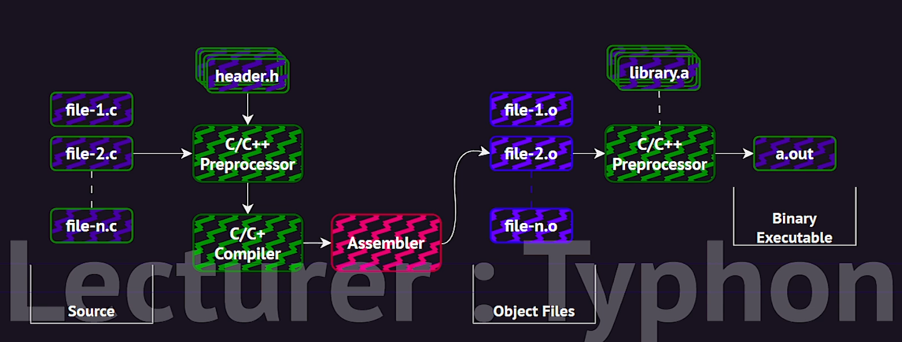

# **Linkers and Loaders**

---

### 1. Writing the Code

You write your program in a high-level language like C, C++, or Java. This is the **source code**.

Example:

```c
#include <stdio.h>

int main() {
    printf("Hello, world!\n");
    return 0;
}
```

---

### 2. Compiling the Source Code

You use a **compiler** (like `gcc` or `clang`) to convert your `.c` file into **machine code**, which becomes an **object file** (`.o` or `.obj`).

- This object file contains:
  - Compiled machine instructions
  - A **symbol table** (information about variables/functions used)
  - It is **relocatable**: it can be loaded into **any memory location**

---

### 3. Linking

Once you have one or more object files, you use a **linker** (built into the compiler, like `ld` in Linux) to create a final **executable file** (like `a.out`, `main.exe`, etc).

The linker does several things:

- Combines multiple object files into one
- Resolves **external symbols**, e.g., linking your code to the standard library functions like `printf()`
- Optionally includes **static libraries**
- Adds relocation information for dynamic linking

You can also link against libraries using flags like `-lm` (for the math library).

After linking, you get a final executable.

---



### 4. Loading

Now, you want to **run** the program. The operating system needs to:

- Load the executable into memory
- Assign memory for code, variables, stack, heap, etc.
- Set the **instruction pointer** to the **entry point** (the first instruction to run)

This is done by the **loader**.

On UNIX/Linux systems:

- You type something like `./main`
- The **shell** runs:
  - `fork()` → creates a new process
  - `exec()` → loads the executable file into that new process's memory and starts running it

So the loader is responsible for:

- Placing the program in memory
- Handling addresses (relocation)
- Jumping to the first instruction (entry point)

---

### 5. Dynamic Linking (Optional)

Instead of linking all libraries **statically** at compile time, modern systems often use **dynamic linking**.

For example:

- Windows uses **DLLs**
- Linux uses **shared objects** (`.so`)

With dynamic linking:

- The executable doesn't include the library code itself
- It contains **relocation info**: tells the loader to find and link the library **at runtime**
- Benefits:
  - Smaller executable
  - Libraries only loaded if needed
  - Shared among multiple programs → saves memory

---

### 6. File Formats

Different systems use standard formats to store compiled programs:

| OS         | Format | Description                    |
| ---------- | ------ | ------------------------------ |
| Linux/UNIX | ELF    | Executable and Linkable Format |
| Windows    | PE     | Portable Executable            |
| macOS      | Mach-O | Mach Object format             |

These formats include:

- Machine code
- Symbol table
- Metadata (e.g., entry point address)

---

### Summary

| Step            | Role                                      |
| --------------- | ----------------------------------------- |
| Source          | You write code (`.c`)                     |
| Compiler        | Makes object file (`.o`)                  |
| Linker          | Combines to make `.exe` or `a.out`        |
| Loader          | Loads it into memory and runs it          |
| Dynamic Linking | Loads external libraries only when needed |
| Format          | ELF (Linux), PE (Windows), Mach-O (macOS) |

---


