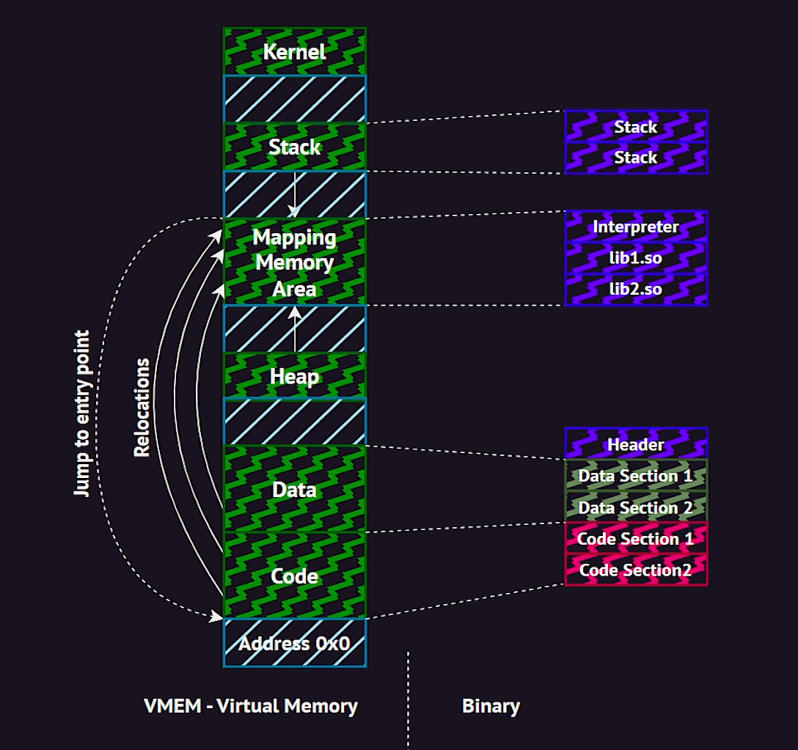

# Binary loading

so when when we decide to run an binary the os initilizes the setup of new process to runing the program complete with its own virtual address space. then the os maps an interpreter into the virtual memory of the process. this interpreter the user space program possess the knowlage and capability to load the binary and perform nessesary reallocations

so the role of interpreter crutial in preparing the binary for execution it carries out series of tasks such as resolving symbols, refrencessetting up the program's initial memory layout and performing nessesary reallocations

by delaging thses risponsbilities to the interpreter the os can ensure a consistant and reliable execution enviroment for binaries across various platforms

linux elf binaries come with an spetial section called `.interp` that specifies the path to the interpreter that is being used to load the binary

```bash
readelf -p .interp elf_file
```

output:

```bash
String dump of section '.interp':
  [     0]  /lib64/ld-linux-x86-64.so.2
```

and so mentioned before the interpreter load the binary into the virtual address space. the space in which the interpreter is loaded 
and it then parses the binary to find out among one of the things, which dinamic lbraries this binary uses so the interpreter maps these into virtual address space using mmap() or other equivalent function and then performs last minute realocations in the binarycode sections to fill in the correct addrssess for refrences to the dynamic libraries

in reality the process of resolving refrences to the functions in the dynamic libraries is often deffered until later. so in other words instead of resolving these refrences immidiatly at load time the interpreter resolve these refrences only when they are invoking for the first time so this is also known as `lazy binding`


if you want to learn about memory mapping area then click [here](./memory_mapping_area.md)

`note`: it is important to note that the binary representation in memory is not nessessariy mirrors its own disk representasion for example the section of zero initilized data wiin the disk binary may have compressed to conserve disk space. however when loaded in the memory these sections expands to contain the actual zero values

### When a typical program is loaded into memory, its memory segments are usually arranged like this:

1. Text Segment (Code Segment)
2. Data Segment (Initialized data)
3. BSS Segment (Uninitialized data)
4. Heap (Dynamic memory allocation)
5. Stack (Function calls, local variables)

---

### Full Memory Layout of a Program (Stack, Heap, Data, BSS, and Code)

Here’s a conceptual memory layout of a typical program in memory:

```
+-----------------------+  <-- Higher memory addresses
|  Stack (grows down)    |
|  Local Variables       |
|  Return Addresses      |
|  Function Calls        |
+-----------------------+
|  Heap (grows up)       |
|  Dynamically Allocated |
|  Memory                |
+-----------------------+
|  BSS Segment           |  <-- Uninitialized data (zeroed out)
|  Uninitialized Vars    |
+-----------------------+
|  Data Segment          |  <-- Initialized data
|  Initialized Vars      |
+-----------------------+
|  Text (Code) Segment   |  <-- Executable code
|  Program Instructions  |
+-----------------------+  <-- Lower memory addresses
```

---

`note` :The heap and stack grow toward each other, so if you keep allocating memory on the heap or stack, they might eventually collide if there's not enough space

If the heap and stack grow toward each other and collide, it can cause:

- `Stack Overflow`: The stack may overwrite the heap, causing a crash or segmentation fault.
- `Heap Corruption`: The heap may be corrupted by the stack, leading to unpredictable behavior, data corruption, or program crashes.
- `Memory Fragmentation`: The available memory may become fragmented, preventing successful memory allocations.

To prevent this, it’s important to manage memory carefully, especially with deep recursion, large allocations on the stack, and frequent dynamic memory allocations. Operating systems usually manage the space between the stack and heap to avoid such collisions, but in certain conditions (e.g., with large allocations or mismanagement of memory), issues can still occur.

### 1. **Code Segment (Text Segment)**

#### Purpose:

- The **code segment**, also known as the **text segment**, is where the **executable instructions** of the program are stored.
- This is the area of memory where the compiled assembly code or machine code resides, and the CPU executes instructions from here.

#### Characteristics:

- It is typically **read-only** to prevent accidental modification of the program's code while running.
- The size of the code segment is usually fixed and determined at compile time.
- In some architectures, the **text segment** may be protected by the OS to prevent any changes to the program's instructions.

#### In NASM:

The code is placed in the `.text` section. This is where you put your program’s instructions, starting with the program’s entry point (often `_start` in assembly programs).

```nasm
section .text
    global _start      ; Entry point
_start:
    ; Program code goes here
    ; For example:
    ; mov eax, 1        ; Load value into register
    ; int 0x80          ; Call interrupt (Linux system call)
```

#### Memory Layout:

- When a program is loaded into memory, the code segment is placed at a specific location (typically at the lower end of memory).
- The program's CPU will start executing instructions from this segment.
- **No variables** are stored in this segment; only executable code is placed here.

---

### 2. **Data Segment (Initialized Data)**

#### Purpose:

- The **data segment** is where **global and static variables** that are **initialized** with fixed values are stored.
- These variables have **known values** at the time of program compilation.

#### Characteristics:

- Variables in this segment have a specific, constant value when the program is loaded into memory.
- The data segment is **read-write** during program execution, since the variables can be modified by the program during runtime.

#### In NASM:

The **initialized data** is placed in the `.data` section. This is where you define variables that are initialized with a value.

```nasm
section .data
    var1 db 10          ; 8-bit initialized variable with value 10
    var2 dw 0x1234      ; 16-bit initialized variable with value 0x1234
    message db 'Hello', 0 ; Initialized string with null terminator
```

#### Memory Layout:

- The data segment contains initialized variables such as constants or user-defined data structures.
- The size and type of the data in the `.data` section are determined at compile-time, and the data is loaded into memory when the program starts.

---

### 3. **BSS Segment (Uninitialized Data)**

#### Purpose:

- The **BSS (Block Started by Symbol)** segment is used for **uninitialized global and static variables**.
- These variables are allocated space but **do not have a specific value** in the source code.
- The operating system **zeroes out** the memory for these variables when the program is loaded into memory.

#### Characteristics:

- Variables in the BSS segment are automatically initialized to **zero** when the program starts, even though no specific value is assigned in the code.
- The BSS segment is typically much larger than the data segment because it only reserves space but doesn't require storing actual values.

#### In NASM:

Uninitialized data is placed in the `.bss` section. This is where you reserve memory for variables without assigning them initial values.

```nasm
section .bss
    var3 resb 1         ; Reserve 1 byte for uninitialized variable
    buffer resb 256     ; Reserve 256 bytes for uninitialized buffer
```

#### Memory Layout:

- The **size** of the BSS segment is determined by the number of variables you define in the `.bss` section and the space they require.
- At runtime, the OS will initialize these variables to zero or to a **null value** when loading the program into memory.

---

### 4. **Heap Segment**

#### Purpose:

- The **heap** is a region of memory used for **dynamic memory allocation** during runtime.
- It is used by functions like `malloc()` or `calloc()` (in C) to allocate memory that is **managed** by the program itself.
- The heap grows **upward** from the **end of the BSS** segment.

#### Characteristics:

- The heap grows dynamically, and memory is allocated as needed by the program at runtime.
- It is **managed** by the operating system and often relies on system calls to allocate and free memory.
- Memory allocated on the heap is typically **not initialized**, and the values stored in the allocated memory are undefined until the program writes to it.

#### In NASM:

- You don’t explicitly define the heap in NASM, as it is managed by the program's runtime and the operating system.
- The heap is typically accessed through system calls, such as `brk()` or `mmap()` in Unix-like systems.

In NASM, while you **cannot directly use the heap** in the same way you might with higher-level languages (such as C with `malloc()`), you **can access the heap** through system calls or operating system APIs, as NASM is simply an assembler that translates your assembly code into machine code. You would need to make use of the operating system's memory management functions to allocate and free heap memory.

### How Heap Memory is Accessed in NASM

To interact with the heap in NASM, you typically rely on **system calls** provided by the operating system (like `mmap`, `brk`, or other memory allocation functions on Linux) to request memory dynamically. These calls are low-level mechanisms for managing memory at runtime.

### On Linux (using `brk` and `mmap` for heap-like memory allocation)

Here are two common ways to allocate heap-like memory from a Linux system in NASM:

#### 1. **Using `brk()` for Heap Allocation**:

The `brk()` system call is one of the traditional ways to manage memory. It increases or decreases the program's data space (heap) by setting the end of the heap.

```nasm
section .text
    global _start

_start:
    ; Request 1024 bytes from the heap
    mov eax, 45          ; brk system call number
    lea ebx, [heap_start] ; New heap end address (address for brk)
    int 0x80             ; Make the system call

    ; Exit program
    mov eax, 1           ; Exit system call number
    xor ebx, ebx         ; Return code 0
    int 0x80

section .bss
heap_start resb 1024      ; Reserve 1024 bytes for heap allocation
```

In this example:

- The `brk` system call (with syscall number 45 on Linux) is used to increase the heap by 1024 bytes.
- `lea ebx, [heap_start]` points to the new heap location.

#### 2. **Using `mmap()` for Heap Allocation**:

`mmap()` is another system call that provides more flexible memory management than `brk()`. You can use `mmap()` to allocate heap-like memory dynamically.

```nasm
section .data
    len dd 1024            ; Length of the memory to allocate

section .text
    global _start

_start:
    ; Request memory from mmap
    mov eax, 90            ; mmap system call number
    xor ebx, ebx           ; addr = NULL (let the OS choose address)
    mov ecx, 3             ; PROT_READ | PROT_WRITE (memory is read/write)
    mov edx, 22            ; MAP_ANONYMOUS | MAP_PRIVATE (anonymous, private memory)
    mov esi, -1            ; fd = -1 (no file)
    xor edi, edi           ; offset = 0
    mov ebx, [len]         ; length of memory to allocate
    int 0x80               ; Make the system call

    ; Exit program
    mov eax, 1             ; Exit system call number
    xor ebx, ebx           ; Return code 0
    int 0x80
```

In this example:

- The `mmap()` system call (syscall number 90 on Linux) is used to allocate 1024 bytes of memory.
- The parameters set various flags like `MAP_ANONYMOUS` (anonymous memory, not backed by a file) and `MAP_PRIVATE` (private memory, not shared).

### Memory Allocation Flags:

- **`MAP_ANONYMOUS`**: This tells the OS that the memory is not backed by a file. It is commonly used for dynamically allocating memory.
- **`MAP_PRIVATE`**: This means changes made to the memory will not be visible to other processes.
- **`PROT_READ`, `PROT_WRITE`**: These are protection flags specifying whether the memory is readable or writable.

### Can You Use the Heap Directly in NASM?

In short:

- **No**, NASM doesn’t provide a built-in method to "use" the heap directly in the way that high-level languages do.
- However, you **can allocate and manage heap memory** by making the appropriate **system calls** for dynamic memory allocation (`brk`, `mmap`, etc.) and then use the allocated memory in your assembly code.

### Conclusion:

Although NASM doesn’t provide built-in mechanisms like `malloc()` in C, it allows you to interact with low-level system calls that enable dynamic memory allocation. To manage heap-like memory in NASM, you would:

1. Use system calls like `mmap` or `brk` to request memory from the OS.
2. Use the allocated memory just like any other memory region (e.g., read, write, etc.).
3. Handle the memory yourself, including freeing it if necessary, though system calls for freeing memory may also depend on the OS or the system call used (e.g., `munmap` for `mmap`).

In summary, you _can_ use the heap in NASM, but you need to rely on the operating system’s mechanisms to allocate and manage it.

#### Memory Layout:

- When a program needs more memory than what is available in the stack or static segments (like data or BSS), it requests additional memory from the heap.
- Memory allocation on the heap can grow or shrink as needed, and the operating system will manage this.

---

### 5. **Stack Segment**

#### Purpose:

- The **stack** is used for **local variables**, **function calls**, **return addresses**, and other **temporary data** used by the program.
- It operates on a **LIFO (Last In, First Out)** principle, meaning the last item pushed onto the stack is the first one to be popped off.

#### Characteristics:

- The stack is **automatically managed** by the system. The compiler or runtime system sets it up when a program starts, and the OS or CPU automatically adjusts it during function calls and returns.
- It grows **downwards** in memory as functions are called and local variables are created.

#### In NASM:

- While the stack itself is managed by the OS, you can manually reserve space on the stack (using `sub esp, N` or similar).
- NASM provides access to the stack in assembly using the `esp` (stack pointer) register for operations like `push` and `pop`.

```nasm
section .text
_start:
    ; Example stack usage
    push eax           ; Push a value onto the stack
    pop ebx            ; Pop a value from the stack into another register
```

#### Memory Layout:

- When a function is called, the return address, local variables, and parameters are pushed onto the stack.
- Each time a function is called, the stack **grows downward**. As the function completes, it **shrinks** by popping data off the stack.
- The stack can grow large depending on the number of function calls and local variables.

### Summary:

- **Text Segment (Code)**: Contains executable instructions. It’s read-only.
- **Data Segment (Initialized Data)**: Contains global and static variables that are initialized with values.
- **BSS Segment (Uninitialized Data)**: Contains global and static variables that are not initialized. These are zeroed out at program load time.
- **Heap**: Used for dynamic memory allocation during runtime. Grows upward.
- **Stack**: Used for function calls, local variables, and return addresses. Grows downward.

---


