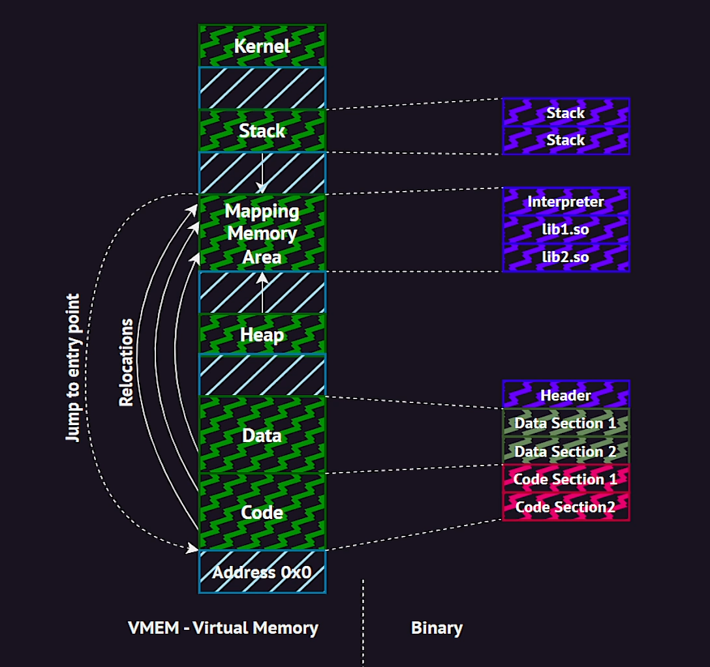

### **ELF Interpreter (`ld-linux.so`) & PE Loader (`ntdll.dll`)**

---

## **🔹 Linux: ELF Interpreter (`ld-linux.so`)**

In **Linux**, dynamically linked executables require an **interpreter** to load shared libraries and resolve symbols before execution begins. This role is handled by **`ld-linux.so`**.

### **1️⃣ What is `ld-linux.so`?**

`ld-linux.so` (Dynamic Linker/Loader) is a **shared object** (`.so`) responsible for:  
✔️ Loading and linking **shared libraries** (`libc.so`, `libm.so`, etc.).  
✔️ Resolving **symbols** for dynamically linked functions.  
✔️ Setting up the **runtime environment** for the process.

### **2️⃣ Where is it Located?**

- **32-bit Systems:** `/lib/ld-linux.so.2`
- **64-bit Systems:** `/lib64/ld-linux-x86-64.so.2`

You can find the ELF interpreter used by an executable using:

```bash
ldd <binary>  # Shows linked shared libraries
readelf -l <binary> | grep 'interpreter'  # Displays interpreter path
```

### **3️⃣ How `ld-linux.so` Works?**

When a dynamically linked ELF binary is executed:  
1️⃣ The **Linux Kernel** loads the ELF **interpreter** (`ld-linux.so`) into memory.  
2️⃣ `ld-linux.so` loads **necessary shared libraries** (e.g., `libc.so.6`).  
3️⃣ It **resolves symbols** by updating **GOT (Global Offset Table)** and **PLT (Procedure Linkage Table)**.  
4️⃣ Finally, it transfers execution to the **entry point** of the executable.

### **4️⃣ Example: Execution Flow**

```bash
./my_program  # Executing a dynamically linked ELF binary
```

🔹 The **Kernel** loads `ld-linux.so`.  
🔹 `ld-linux.so` loads `libc.so`, `libm.so`, etc.  
🔹 `ld-linux.so` resolves function addresses.  
🔹 Execution is transferred to **`main()`**.

### **5️⃣ Static vs. Dynamic Linking**

- **Static Executable**: **Does NOT use `ld-linux.so`**, as all code is embedded.
- **Dynamic Executable**: **Requires `ld-linux.so`**, which loads shared libraries dynamically.

---

## **🔹 Windows: PE Loader (`ntdll.dll`)**

In **Windows**, when a PE (Portable Executable) file is executed, the **PE Loader** inside `ntdll.dll` is responsible for loading and preparing it for execution.

### **1️⃣ What is `ntdll.dll`?**

`ntdll.dll` (Windows Native API Library) is a **low-level system DLL** responsible for:  
✔️ Handling the **PE loading process**.  
✔️ Managing **memory mapping of sections** (code, data, imports).  
✔️ Resolving **DLL dependencies**.  
✔️ Preparing execution for **`kernel32.dll`** and **user-mode execution**.

### **2️⃣ Where is it Located?**

- `C:\Windows\System32\ntdll.dll` (for 64-bit Windows)
- `C:\Windows\SysWOW64\ntdll.dll` (for 32-bit programs on 64-bit Windows)

### **3️⃣ How `ntdll.dll` Works?**

When an EXE is executed:  
1️⃣ The **Windows Loader** identifies the PE format and **loads `ntdll.dll`** into memory.  
2️⃣ `ntdll.dll` maps the **sections** of the PE file (`.text`, `.data`, `.rdata`).  
3️⃣ It **resolves DLL dependencies** (e.g., `kernel32.dll`, `user32.dll`).  
4️⃣ The process is handed over to `kernel32.dll`, which starts execution.

### **4️⃣ Example: Execution Flow**

```powershell
start my_program.exe  # Running an EXE file
```

🔹 The Windows **PE Loader** maps the executable into memory.  
🔹 `ntdll.dll` loads `kernel32.dll` and resolves dependencies.  
🔹 Execution is transferred to **the entry point** of the executable.

### **5️⃣ Static vs. Dynamic Linking**

- **Static Executable**: Includes all code, reducing reliance on external DLLs.
- **Dynamic Executable**: Uses `ntdll.dll` to load **DLLs dynamically**.

---

## **📌 Summary: ELF vs. PE Loading Mechanism**

| Feature              | Linux (`ld-linux.so`)            | Windows (`ntdll.dll`)           |
| -------------------- | -------------------------------- | ------------------------------- |
| **Role**             | ELF Interpreter & Dynamic Linker | PE Loader                       |
| **Executes**         | Dynamically linked ELF binaries  | PE (EXE, DLL) files             |
| **Loads Libraries**  | `libc.so`, `libm.so`, etc.       | `kernel32.dll`, `user32.dll`    |
| **Resolves Symbols** | GOT, PLT updates                 | Import Address Table (IAT)      |
| **Location**         | `/lib64/ld-linux-x86-64.so.2`    | `C:\Windows\System32\ntdll.dll` |

---


