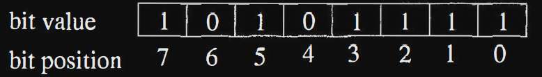
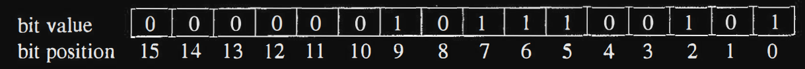
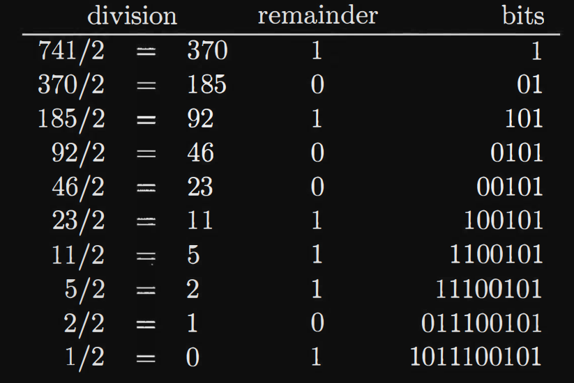
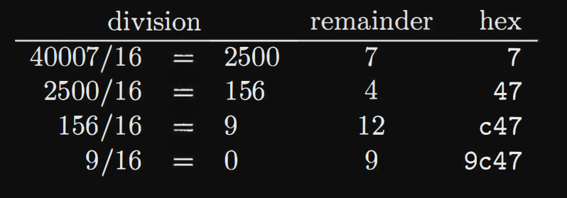
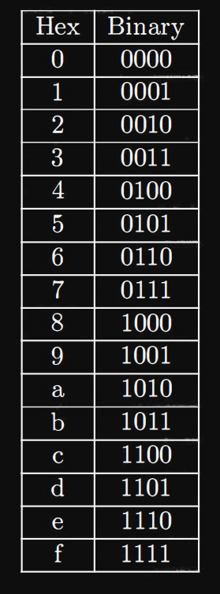
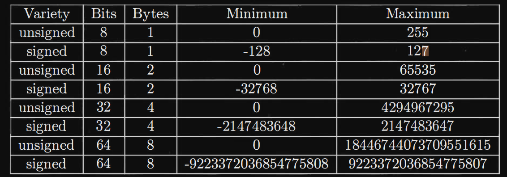
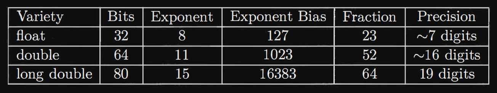
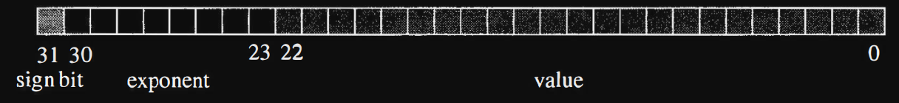

# Numbers

All information in a computer is stored as collections of bits. These bits
can be interpreted in a variety of ways as numbers. In this chapter we
will discuss binary numbers, hexadecimal numbers, integers and floating
point numbers.

- ## Binary numbers

We are used to representing numbers in the decimal place-value system.
In this representation, a number like 1234 means 1 _ 10^3 + 2_ 10^2 +3\* 10 +4.
Similarly binary numbers are represented in a place-value system using 0
and 1 as the "digits" and powers of 2 rather than powers of 10.
Let's consider the binary number 10101111. This is an 8 bit number
so the highest power of 2 is 2^7
. So this number is

```bash
10101111 = 2^7 + 2^5 + 2^3 + 2^2 + 2 + 1
= 128 + 32 + 8 + 4 + 2 + 1
= 175
```

0 will be ignored

The bits of an 8 bit number are numbered from 0 to 7 with 0 being the
least significant bit and 7 being the most significant bit. The number
175 has its bits defined below.



The conversion from binary to decimal is straightforward. It takes a
little more ingenuity to convert from decimal to binary. Let's examine the number 741.
The highest power of 2 less than (or equal to) 741 is
2^9 = 512. So we have

```bash
741 = 512 + 229
= 2^9 + 229
```

Now we need to work on 229. The highest power of 2 less than 229 is
2^7 = 128. So we now have

```bash
741 = 512 + 128 + 101
= 2^9 + 2^7 + 101
```

The process continues with 101. The highest power of 2 less than 101
is 2^6 = 64. So we get

```bash
741 = 512 + 128 + 64 + 37
= 2^9 + 2^7 + 2^6 + 37
```

Next we can find that 37 is greater than 25 = 32, so

```bash
7 41 = 512 + 128 + 64 + 32 + 5
= 2^9 + 2^7 + 2^6 + 2^5 + 5
```

Working on the 5 we see that

```bash
741 = 512 + 128 + 64 + 32 + 4 + 1
= 2^9 + 2^7 + 2^6 + 2^5 + 2^2 + 1
= 1011100101
```

Below is 741 expressed as a 16 bit integer.



An alternative method for converting a decimal number to binary is
by repeated division by 2. At each step, the remainder yields the next
higher bit.

Let's convert 741 again.



A binary constant can be represented in the NASM by appending "b" to the end of a string of O's and 1 's. So we could represent
741 as 1011100101b.

---

- ## HEXADECIMAL NUMBERS

Binary numbers are a fairly effective way of representing a string of bits,
but they can get pretty tedious if the string is long. In a 64 bit computer
it is fairly common to work with 64 bit integers. Entering a number as
64 bits followed by a "b" would be tough. Decimal numbers are a much
more compact representation, but it is not immediately apparent what
bits are O's and 1's in a decimal number.

A hexadecimal number is a number in base 16. So we need "digits"
from 0 to 15. The digits from 0-9 are just like in decimal. The digits
from 10-15 are represented by the letters 'A' through 'F'. We can also
use lower case letters. Fortunately both yasm/nasm and C/C++ represent hexadecimal numbers using the prefix Ox. You could probably use OX but
the lower case x tends to make the numbers more visually obvious.

```bash
Oxala = 10 * 16^2 + 1 * 16 + 10
= 10 * 256 + 16 + 10
= 2586
```

Converting a decimal number to hexadecimal follows a pattern like the
one used before for binary numbers except that we have to find the highest
power of 16 and divide by that number to get the correct "digit". Let's
convert 40007 to hexadecimal. The first power of 16 to use is 16^3 = 4096.
40007/4096 = 9 with a remainder of 3143, so we have

```bash
40007 = 9 * 16^3 + 3143
```

3143/16^2 = 3143/256 = 12 with a remainder of 71, so we get

```bash
40007 = 9 * 16^3 + 12 * 162 + 71
```

71/16 = 4 with a remainder of 7, so the final result is

```bash
40007 = 9 * 16^3 + 12 * 16^2 + 4 * 16 + 7 = Ox9c47
```

As with conversion to binary we can perform repeated division and
build the number by keeping the remainders.



Converting back and forth between decimal and binary or decimal
and hexadecimal is a bit painful. Computers can do that quite handily,
but why would you want to convert from decimal to hexadecimal? If
you are entering a value in the assembler, simply enter it in the form
which matches your interpretation. If you're looking at the number 1027
and need to use it in your program, enter it as a decimal number. If you
want to represent some pattern of bits in the computer, then your choices
are binary and hexadecimal. Binary is pretty obvious to use, but only
for fairly short binary strings. Hexadecimal is more practical for longer
binary strings.

Consult the table below to convert between binary and
hexadecimal.



Let's now consider converting Ox1a5b to binary. 1 = 0001, a = 1010,
5 = 0101 and b = 1011, so we get

```bash
Ox1a5b = 0001 1010 0101 1011 = 0001101001011011b
```

- ## Integers

On the x86-64 architecture integers can be 1 byte, 2 bytes, 4 bytes, or 8
bytes in length. Furthermore for each length the numbers can be either
signed or unsigned: Below is a table listing minimum and maximum
values for each type of integer.



The range of 64 bit integers is large enough for most needs. Of course
there are exceptions, like 20! = 51090942171709440000.
Unsigned integers are precisely the binary numbers discussed earlier.
Signed integers are stored in a useful format called "two's complement".
The first bit of a signed integer is the sign bit. If the sign bit is 0, the
number is positive. If the sign bit is 1, the number is negative. The most
obvious way to store negative numbers would be to use the remaining
bits to store the absolute value of the number.

Let's consider 8 bit signed integers and what we would get if we used
the existing circuitry to add 2 such integers. Let's add -1 and 1. Well, if
we store -1 with a sign bit and then the value we would get

```bash
-1 =   1000 0001
 1 =   0000 0001
---------------
-1+1 = 1000 0010
```

Oops! We end up with -2 rather than 0.

Let's try storing 8 bit numbers as a sign bit and invert the bits for
the absolute value part of the number:

```bash
-1 =   1111 1110
1  =   0000 0001
-----------------
-1+1 = 1111 1111
```

Now this is interesting: the result is actually -0 (in 1st compliment), rather than 0. This
sounds somewhat hopeful. Let's try a different pair of numbers:

Too bad! It was close. What we need it to add one to the complemented
absolute value for the number. This is referred to as "two's complement"
arithmetic. It works out well using the same circuitry as for unsigned
numbers and is mainly a matter of interpretation.
So let's convert -1 to its two's complement format.

-1 : 1 for the sign bit
0000001 for the absolute value
1111110 for the complement
1111111 after adding 1 to the complement

-1 = 11111111 after prefixing the sign bit

so lets add this

```bash
-1 =   1111 1111  #2's compliment
1  =   0000 0001
-----------------
-1+1 = 10000 0000
```

but we will ignore the 1 as it will automatically overflow
so we will get `0000 0000` which is the right answer

- ## Floating point numbers

The x86-64 architecture supports 3 different varieties of floating point
numbers: 32 bit, 64 bit and 80 bit numbers. These numbers are stored in
IEEE 754 format. Below are the pertinent characteristics of these types:



The IEEE format treats these different length numbers in the same
way, but with different lengths for the fields. In each format the highest
order bit is the sign bit. A negative number has its sign bit set to 1 and
the remaining bits are just like the corresponding positive number. Each
number has a binary exponent and a fraction. We will focus on the float
type to reduce the number of bits involved.



The exponent for a float is an 8 bit field. To allow large numbers or
small numbers to be stored, the exponent is interpreted as positive or
negative. The actual exponent is the value of the 8 bit field minus 127.

8bits - 127 = exponent

127 is the "exponent bias" for 32 bit floating point numbers

For 64-bit floating point numbers (also known as double precision in IEEE 754 format), the exponent bias is `1023`.

but for the sake of simplicity we will be working with 32 bit

The fraction field of a float holds a small surprise. Since 0.0 is defined
as all bits set to 0, there is no need to worry about representing 0.0 as
an exponent field equal to 127 and fraction field set to all O's. All other
numbers have at least one 1 bit, so the IEEE 754 format uses an implicit 1
bit to save space. So if the fraction field is 00000000000000000000000, it
is interpreted as 1. 00000000000000000000000. This allows the fraction
field to be effectively 24 bits. This is a clever trick made possible by
making exponent fields of 0x00 and 0xFF special.

A number with exponent field equal to OxOO is defined to be 0. Interestingly, it is possible to store a negative 0. An exponent of OxFF is
used to mean either negative or positive infinity. There are more details required for a complete description of IEEE 754, but this is sufficient for our needs.

lets se how we can represent 1.0 in hexadecimal if i create an dd(Define Doubleword 4 bytes) 1.0
so it will lok like this in memory 3F800000 in LE format
The most significant byte is 3F. The sign bit is 0. The exponent field consists of the other 7 bits of
the most significant byte and the first bit of the next byte.
This means that the exponent field is 127 and the actual binary exponent is 0.
The remaining bits are the binary fraction field - all O's. Thus the value is

1.0 \* 2^0 = 1.0

now this will look like this in memory binary
`00111111100000000000000000000000`

```bash
   0             01111111        00000000000000000000000
sighn bit       exponent+127     value
                                (mantissa)
```

lets take another example
Let's convert **122.5** into its IEEE 754 single-precision floating-point representation.

### Step 1: Convert the integer part (122) to binary.

Start by converting **122** (decimal) to binary:

- **122 ÷ 2 = 61** remainder **0**
- **61 ÷ 2 = 30** remainder **1**
- **30 ÷ 2 = 15** remainder **0**
- **15 ÷ 2 = 7** remainder **1**
- **7 ÷ 2 = 3** remainder **1**
- **3 ÷ 2 = 1** remainder **1**
- **1 ÷ 2 = 0** remainder **1**

So, **122** in binary is `1111010`.

### Step 2: Convert the fractional part (0.5) to binary.

To convert the fractional part **0.5** into binary:

- **0.5 × 2 = 1.0** (integer part = 1, fractional part = 0.0)

Extract the integer part: The integer part here is 1, so you write down 1.
Fractional part is now 0.0: After extracting the integer part, the remaining fractional part is 0.0. This means the process is finished because there is no remaining fraction to continue converting.

In binary, numbers to the right of the decimal point represent negative powers of 2. Each digit in the binary fraction represents a power of 2, starting with:

- 2^-1
- 2^-2
- 2^-3
- and so on.

For **0.5**, this is equal to:

0.5 = 2^-1

Which means **half of 1**, or **0.1** in binary.

### Step 3: Combine the integer and fractional parts.

Combining the binary representations of the integer part `122` and the fractional part `0.5`:

122.5 = 1111010.1

### Step 4: Normalize the binary number.

In normalized scientific notation (binary), the binary point is moved so that there is exactly one non-zero digit to the left of the point:

1111010.1 = 1.1110101 x 2^6

Here, the mantissa is `1.1110101` and the exponent is `6`.

### Step 5: Encode in IEEE 754 format.

1. **Sign bit**: Since the number is positive, the sign bit is `0`.

2. **Exponent**: The exponent is `6`, but since the exponent in IEEE 754 format is biased by 127, we add 127 to the exponent:
   6 + 127 = 133
   In binary, `133` is `10000101`.

3. **Mantissa**: The mantissa is `1.1110101`, but the leading `1` is **implicit**, so we only store the fractional part: `11101010000000000000000`.

### Final IEEE 754 Representation:

- **Sign bit**: `0`
- **Exponent**: `10000101` (binary for 133)
- **Mantissa**: `11101010000000000000000`

The IEEE 754 representation of **122.5** in single-precision (32-bit) floating-point format is:

```
0 10000101 11101010000000000000000
```

lets take another example in which there is an round up

**1.1** in hexadecimal representation `0x3F8CCCCD`.

### Step 1: Converting 1.1 to IEEE 754 Single Precision

We need to convert **1.1** into IEEE 754 **single-precision** (32-bit) floating-point format.

1. **Convert the number to binary**:

   Now, we focus on the fractional part, which is **0.1** in decimal. To convert this to binary, we repeatedly multiply the fractional part by 2 and record the integer part (the result before the decimal point) at each step.

- **0.1 × 2 = 0.2** → integer part = **0**, fractional part = **0.2**
- **0.2 × 2 = 0.4** → integer part = **0**, fractional part = **0.4**
- **0.4 × 2 = 0.8** → integer part = **0**, fractional part = **0.8**
- **0.8 × 2 = 1.6** → integer part = **1**, fractional part = **0.6**
- **0.6 × 2 = 1.2** → integer part = **1**, fractional part = **0.2**
- **0.2 × 2 = 0.4** → integer part = **0**, fractional part = **0.4**

At this point, we can see that the fractional part repeats starting from **0.2** again.

#### Step 3: Write the binary representation

Taking the integer parts we got from the multiplication steps, we get the binary representation of the fractional part as:

0.1 = 0.0001100110011001100110011...

so 1.1 will become

1.1 = 1.0001100110011001100110011...

2. **Normalize the number**:
   - In normalized form, the binary number `1.0001100110011001100110011...` becomes `1.0001100110011... × 2^0` (since there's already a `1` to the left of the decimal point).
3. **Encode the IEEE 754 format**:
   - **Sign bit**: `0` (since 1.1 is positive),
   - **Exponent**: The exponent is `0`, but in IEEE 754, it is biased by 127, so the exponent is stored as `127` (which is `01111111` in binary),
   - **Mantissa**: We store the fractional part after the leading `1` (which is implicit), so it’s `0001100110011...`. The mantissa is stored with a precision of 23 bits.

### Step 2: Rounding the Fraction

Now, let’s look at the fractional part more closely:

- **True fraction**: `000110011001100110011001100110011001100110011001...`
- **IEEE 754 mantissa** (23 bits): `00011001100110011001100`

Notice that in the IEEE 754 representation, we have a **repeated pattern** of `0001100110011`, but only the first 23 bits are stored, so the **remaining bits** are truncated or rounded.

When you round, you typically look at the extra bit that would follow the last bit you store. In this case, if you were to round, the bit that follows the 23rd bit would be considered, and based on that, the last bit might be rounded up. For example:

- If the extra bit (the 24th bit) is `1`, the 23rd bit is **rounded up**.
- If the extra bit is `0`, the last bit remains unchanged.

In your example, **the last bit has been rounded up**.

### Step 3: Hexadecimal Representation

Once we round the bits, we get the 32-bit result:

- The final IEEE 754 representation of **1.1** in binary (after rounding) is:
  ```
  0 01111111 00011001100110011001100
  ```
- This converts to hexadecimal as:
  ```
  0x3F8CCCCD
  ```

## Converting floats to decimal

now lets see how to convert the float back into float

An example will illustrate how to convert a float to a decimal number.
Let's work on the float value Ox43263000.

The sign bit is 0, so the number is positive. The exponent field is
010000110 which is 134, so the binary exponent is 134 - 127 = 7. The fraction field
is 010 0110 0011 0000 0000 0000 0000, so the fraction with implied 1 is 1.01001100011.

```bash
1.010011000112 * 2^7 = 10100110.00112
166 + 2^-3 + 2^-4
166 + 0.125 + 0.0625
166.1875
```

## Floating point addition

In order to add two floating point numbers, we must first convert the
numbers to binary real numbers. Then we need to align the binary points
and add the numbers. Finally we need to convert back to floating point.

Let's add the numbers 41.275 and 0.315. In hexadecimal these numbers are Ox4225199a and Ox3ea147ae . Now let's convert Ox4225199a to
a binary number with a binary exponent.

The exponent field is composed of the first two nibbles and a 0 bit from the next nibble. This is
10000100 = 132, so the exponent is 132 - 127 = 5. The fractional part
with the understood 1 bit is

`1.01001010001100110011010`

So we have

Ox4225199a = 1 .01001010001100110011010 \* 2^5

101001.010001100110011010

Similarly Ox3ea147ae has an exponent field of the first 2 nibbles and
a 1 from the third nibble. So the exponent field is 01111101 = 125
yielding an exponent of -2. The fractional part with the understood 1 bit iS

`1.01000010100011110101110`

So we have

Ox3ea147ae = 1.01000010100011110101110 \* 2^-2

0.0101000010100011110101110

Now we can align the numbers and add

```bash
  101001 . 01000 1 1001 10011010
+      0 . 01010000 10100011110101110
--------------------------------------
  101001 . 1001011 100001010010101110
```

Now we have too many bits to store in a 32 bit float. The rightmost
7 bits will be rounded (dropped in this case) to get

101001.100101110000101001

1.010011001011 10000101001 * 2^5

So the exponent is 5 and the exponent field is again 132. Dropping
the leading 0, we get Ox42265c29 which is `41.59` (approximately).


## Floating point multiplication 

Floating point multiplication can be performed in binary much like decimal multiplication. Let's skip the floating point to/from binary conversion and just focus on the multiplication of 7.5 and 4.375. 

```bash
    7.5 = 111.1
* 4.375 = 100.011 
------------------
            1111
           11110
       111100000 
------------------
     100000.1101
```

