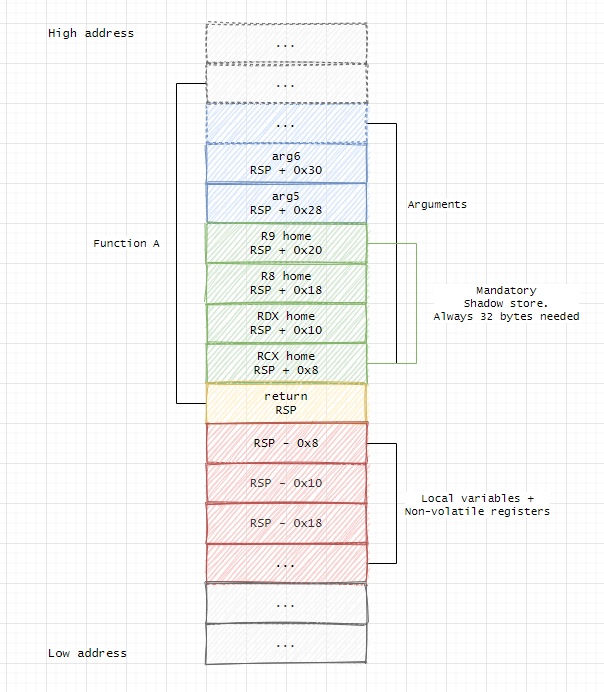

# Windows vs Linux Ccallling convention

here we will discuss the differnece in the linux and windows Ccalling convention in both x64 and x 86

we will write an small c++/c code and compare there assemblly to see the difference in only the calling convention

```cpp
#include <iostream>

int fun(int a, int b, int c, int d, int e, int f)
{
    return (a + b + c + d + e + f);
}

int main()
{
    int a = 1, b = 1, c = 1, d = 1, e = 1, f = 1;

    fun(a, b, c, d, e, f);

    return 0;
}
```

## Windows

- ### X86(cdecl)

In the cdecl calling convention (used by default in 32-bit C/C++ programs on Windows):

- Function arguments are pushed right-to-left onto the stack.
- The caller cleans up the stack after the function returns
- Return value is placed in EAX.
- Stack alignment : 4-byte aligned

the dissassemblly of the main function before calling the fun() will look like

caller:

```bash
002718E0  mov         eax,dword ptr [f]
002718E3  push        eax
002718E4  mov         ecx,dword ptr [e]
002718E7  push        ecx
002718E8  mov         edx,dword ptr [d]
002718EB  push        edx
002718EC  mov         eax,dword ptr [c]
002718EF  push        eax
002718F0  mov         ecx,dword ptr [b]
002718F3  push        ecx
002718F4  mov         edx,dword ptr [a]
002718F7  push        edx
002718F8  call        fun (02713C0h)  #fun(a, b, c, d, e, f);
002718FD  add         esp,18h
```

in 32-bit, arguments are always passed on the stack.
so meaning that no matter how many arrguments are there it is always passed using stack

Registers like EAX, EBX, ECX, etc., are not used to pass function arguments. They are only used:

- Temporarily to move or store data
- For internal calculations
- To help load arguments from the stack

Why Not Just Work on the Stack?
While technically possible, this is:

- Slower (accessing RAM vs. registers)
- More complex (you can't add [ebp+8], [ebp+12] directly)
- Not how CPUs are optimized to run

---

<br>

callee:

heres the dissassemblly of the callee

```bash
int fun(int a, int b, int c, int d, int e, int f)
{
00271820  push        ebp  # Save old base pointer
00271821  mov         ebp,esp  #  Set new base pointer to current stack pointer
00271823  sub         esp,0C0h  # Reserve 192 bytes (0xC0) for local variables

#  Saving Callee-Saved Registers

00271829  push        ebx
0027182A  push        esi
0027182B  push        edi
0027182C  mov         edi,ebp
0027182E  xor         ecx,ecx
00271830  mov         eax,0CCCCCCCCh   # debug pattern commonly used by Microsoft Visual C++.
00271835  rep stos    dword ptr es:[edi]   # initialize or clear a block of memory in the stack or heap.
00271837  mov         ecx,offset _2398A6F0_FileName@cpp (027C068h)
0027183C  call        @__CheckForDebuggerJustMyCode@4 (0271325h)  # calls a function that likely checks whether the code is being run under a debugger.
00271841  nop # does nothing and might be used for alignment or to pad the code.
    return (a + b + c + d + e + f);
00271842  mov         eax,dword ptr [a]  # Actually is [ebp+8]
00271845  add         eax,dword ptr [b]  # Actually is [ebp+12]
00271848  add         eax,dword ptr [c]  # Actually is [ebp+16]
0027184B  add         eax,dword ptr [d]  # Actually is [ebp+20]
0027184E  add         eax,dword ptr [e]  # Actually is [ebp+24]
00271851  add         eax,dword ptr [f]  # Actually is [ebp+28]
}
```

Here’s what the stack looks like just after entering fun():

| Stack Address | Contains       | Accessed As          |
| ------------- | -------------- | -------------------- |
| `ebp+4`       | Return address | (used automatically) |
| `ebp+8`       | Argument `a`   | `[ebp+8]`            |
| `ebp+12`      | Argument `b`   | `[ebp+12]`           |
| `ebp+16`      | Argument `c`   | `[ebp+16]`           |
| `ebp+20`      | Argument `d`   | `[ebp+20]`           |
| `ebp+24`      | Argument `e`   | `[ebp+24]`           |
| `ebp+28`      | Argument `f`   | `[ebp+28]`           |

<br><br>

the callee also saves the caller registers (also called Callee-Saved Registers)

Callee-saved registers are the CPU registers that a called function (callee) must preserve if it wants to use them. That means:
If the callee modifies these registers, it must restore their original values before returning to the caller.

In 32-bit x86 calling convention (cdecl):

These are the callee-saved registers:

- EBX
- ESI
- EDI
- EBP

| Register | Role              | Must be preserved by | Common use                   |
| -------- | ----------------- | -------------------- | ---------------------------- |
| `EBX`    | General-purpose   | **Callee**           | Storage, counters            |
| `ESI`    | Source index      | **Callee**           | String/memory source pointer |
| `EDI`    | Destination index | **Callee**           | String/memory dest pointer   |
| `EBP`    | Stack frame base  | **Callee**           | Frame/local var addressing   |

Why is this important?
The caller may rely on these registers to hold data across function calls. If the callee doesn't restore them, it could lead to bugs and unexpected behavior.

now lets see the return value from the callee

```bash
00271842  mov         eax,dword ptr [a]    # it just adds all the values and moves them in the eax register
00271845  add         eax,dword ptr [b]
00271848  add         eax,dword ptr [c]
0027184B  add         eax,dword ptr [d]
0027184E  add         eax,dword ptr [e]
00271851  add         eax,dword ptr [f]
```

the caller then can access the returned value by using the eax register

after that we get to return

```bash
00751854  pop         edi
00751855  pop         esi
00751856  pop         ebx
00751857  add         esp,0C0h
0075185D  cmp         ebp,esp
0075185F  call        __RTC_CheckEsp (0751249h)
00751864  mov         esp,ebp
00751866  pop         ebp
00751867  ret
```

cleanup and return process of a function.

The instructions are popping the saved registers off the stack

This instruction adjusts the stack pointer (esp) by adding 0xC0 (192 bytes). This is a cleanup operation to restore the stack to its state before the function was called. this is not the full cleanup of the stack the full & last clean up of the tack is done by the caller

`cmp ebp, esp`: This instruction compares the values in the ebp (base pointer) and esp (stack pointer) registers.
ebp is the base pointer used by the function to keep track of the stack frame. By the time the function exits, ebp should be at the same place as esp, ensuring that the stack is clean and in a consistent state.

`call __RTC_CheckEsp`: This instruction calls a runtime check function (`__RTC_CheckEsp`) to verify that the stack pointer (esp) and base pointer (ebp) match up properly. This is a sanity check performed to ensure that the stack hasn’t been corrupted during the function's execution.

`mov esp, ebp`: This instruction restores the stack pointer (esp) to the value of the base pointer (ebp), effectively undoing the changes made to esp by the function.

`pop ebp` : This pops the value of ebp from the stack, which was saved at the beginning of the function.

``ret` : Finally, the ret instruction is used to return control to the calling function. This instruction pops the return address from the stack and jumps to that address, transferring control back to the instruction after the call in the caller

---

<br>
<br>

now the last thing is stack cleanup which is done by the caller in cdecl

```bash
002718FD  add         esp,18h
```

means that 24 bytes (0x18 in hex) are being removed from the stack, effectively cleaning up the stack.

ESP (Stack Pointer) is incremented by 0x18 (24 in decimal).
This discards (removes) 6 arguments × 4 bytes each = 24 bytes, which were pushed onto the stack before a function call.

6 arguments × 4 bytes = 24 bytes (0x18)

<br>
<br>

now lets see an case in which the return value is way bigger for eax register to handle lets see an example

```c
#include <iostream>

struct LargeStruct {
    int data[100];
};

LargeStruct fun(const LargeStruct& x)
{
    return x;   //returning by value so a copy is made
}

int main()
{
    LargeStruct x;

    for (int i = 0; i < 100; ++i)
        x.data[i] = i;

    LargeStruct y = fun(x);

    std::cout << "y.data[0] = " << y.data[1] << std::endl;

    return 0;
}
```

heres the assembly before the function is called

```bash
    LargeStruct y = fun(x);
00525EFC  lea         eax,[x]        # Load address of x
00525F02  push        eax
00525F03  lea         ecx,[ebp-714h]   # setting up an address, possibly where the return value of fun(x) will be stored.
00525F09  push        ecx
00525F0A  call        fun (052146Fh)
00525F0F  add         esp,8
00525F12  mov         ecx,64h
00525F17  mov         esi,eax
00525F19  lea         edi,[y]
00525F1F  rep movs    dword ptr es:[edi],dword ptr [esi]
```

you may be asking why are we pushing [ebp-714h] on the stack as an argument this is because the function returns a large struct by value, and the calling convention requires the caller to allocate space and pass a pointer to it.

well it will not be passed if the function returns an int or similarly small type. it is only valid for large types

You can't return that in a single register. So, a pointer to a pre-allocated buffer is passed to fun() as a hidden first argument(explicitly).

we will look into it latter in the callee

now lets look how callee look like

```bash
LargeStruct fun(const LargeStruct& x)
{
00E125A0 55                   push        ebp
00E125A1 8B EC                mov         ebp,esp
00E125A3 81 EC C0 00 00 00    sub         esp,0C0h
00E125A9 53                   push        ebx
00E125AA 56                   push        esi
00E125AB 57                   push        edi
00E125AC 8B FD                mov         edi,ebp   # edi is often used as the destination pointer in memory operations (like rep movs).
00E125AE 33 C9                xor         ecx,ecx
00E125B0 B8 CC CC CC CC       mov         eax,0CCCCCCCCh
00E125B5 F3 AB                rep stos    dword ptr es:[edi]
00E125B7 B9 6A F0 E1 00       mov         ecx,offset _2398A6F0_FileName@cpp (0E1F06Ah)
00E125BC E8 D7 ED FF FF       call        @__CheckForDebuggerJustMyCode@4 (0E11398h)
00E125C1 90                   nop
    return x;
00E125C2 B9 64 00 00 00       mov         ecx,64h      # moving 100 in ecx
00E125C7 8B 75 0C             mov         esi,dword ptr [x]   # here x is [esp+0x0c]
00E125CA 8B 7D 08             mov         edi,dword ptr [ebp+8]   # this is the buffer , pointer to the return buffer
00E125CD F3 A5                rep movs    dword ptr es:[edi],dword ptr [esi]
00E125CF 8B 45 08             mov         eax,dword ptr [ebp+8]
}
00E125D2 5F                   pop         edi
00E125D3 5E                   pop         esi
00E125D4 5B                   pop         ebx
00E125D5 81 C4 C0 00 00 00    add         esp,0C0h
00E125DB 3B EC                cmp         ebp,esp
00E125DD E8 BC EC FF FF       call        __RTC_CheckEsp (0E1129Eh)
00E125E2 8B E5                mov         esp,ebp
00E125E4 5D                   pop         ebp
00E125E5 C3
```

we are moving 100 in ecx. ecx is used by the rep movs instruction to know how many times to copy.
then we Load into esi the pointer to x — this is the second argument to the function. we have already discoused why there are two args

first it loads ecx with 100 . This is the loop counter for rep movs dword.
then we load esi with x. This instruction copies that address (not the whole struct) into the ESI register.

then we store the address of return buffer(esp+8) in the edi register. This is where the function should copy the contents of x — the result of `return x;`

`rep movs dword ptr es:[edi], dword ptr [esi]` this instruction is of intrest

- Repeats movs instruction ECX times (100 times here).
- Each movs dword ptr copies 4 bytes from [ESI] to [EDI].
- Effectively: memcpy(EDI, ESI, 400);

This instruction copies 4 bytes (one dword) from the memory location pointed to by esi to the memory location pointed to by edi. So, it doesn't copy data within the stack itself, but rather between the memory locations that esi and edi point to.

So, to clarify again:

The stack holds pointers, but the data is stored at the memory locations that those pointers point to.

then we do `mov eax, dword ptr [ebp+08h]` this indicates that the value being accessed is a pointer to a 32-bit (4-byte) value.
and is moved into eax

The eax register will have the address of the temp object or buffer

the epilog of the function is same nothing different

lets see the caller assemblly after calling the fun()

```bash
00FA5ED6 83 C4 08             add         esp,8
00FA5ED9 B9 64 00 00 00       mov         ecx,64h
00FA5EDE 8B F0                mov         esi,eax
00FA5EE0 8D BD D0 FC FF FF    lea         edi,[y]
00FA5EE6 F3 A5                rep movs    dword ptr es:[edi],dword ptr [esi]
```

first we are cleanig the stack by removing the argument by adding 8 in esp
then we move 100 in ecx because it will be used in rep movs instruction

then we move the eax into esi and then move the address of the y in edi

now esi contains the temp object, where the edi contains the address of the y

and at last we do an `rep movs    dword ptr es:[edi],dword ptr [esi]` which moves the temp object into y

here you have seen that there are in total 3 objects so why are there only 2 objects this is because compiler uses a technique called `Copy elision`

if you want to learn about copy elision click [here](../../cpp_cource/Copy_elision.cpp)

---

<br>
<br>
<br>

- ### X64 (Microsoft x64) (Microsoft ABI)

- First four integer or pointer arguments: These are passed in registers.
- RCX, RDX, R8, R9: These registers hold the first four arguments, in this order.
- Remaining arguments: If a function has more than four arguments, the remaining arguments are passed on the stack.
- The arguments are pushed onto the stack in right-to-left order.

- The return value of a function is placed in the RAX register.

If the function returns a larger data type (like a structure), the calling convention specifies the use of additional registers or the stack to return the value.

- Stack alignment : 16-byte aligned

lets see this uisng an example

```cpp
#include <iostream>

int fun(int a, int b, int c, int d)
{
    return (a + b + c + d);
}

int main()
{
    int a = 1, b = 1, c = 1, d = 1;

    fun(a, b, c, d);

    return 0;
}
```

lets see the assemblly when the fnction is called

```bash
    fun(a, b, c, d);
00007FF6BEF21F48 44 8B 4D 64          mov         r9d,dword ptr [d]
00007FF6BEF21F4C 44 8B 45 44          mov         r8d,dword ptr [c]
00007FF6BEF21F50 8B 55 24             mov         edx,dword ptr [b]
00007FF6BEF21F53 8B 4D 04             mov         ecx,dword ptr [a]
00007FF6BEF21F56 E8 0F F5 FF FF       call        fun (07FF6BEF2146Ah)
00007FF6BEF21F5B 90                   nop
```

here if you are an keen absorver you can see that we have used 32 bit register instead of 64 bit why is that the reason behind it is that Writing to a 32-bit register (like eax, edx, r8d) is actually more efficient than writing to the full 64 bit register

for example

```bash
mov r8d, 0x12345678   ; R8 = 0x0000000012345678
```

Zeroes out the upper 32 bits of the full 64-bit register.

now in this code we have only used 4 arguments to pass to the function which is passsed using the registers but if we increase the no of argument more than 4 we will see that the 5th argument will be pushed on the stack and passed to the function

lets see this by using this example

```cpp
#include <iostream>

int fun(int a, int b, int c, int d, int e, int f)
{
    return (a + b + c + d + e + f);
}

int main()
{
    int a = 1, b = 1, c = 1, d = 1, e = 1, f = 1;

    fun(a, b, c, d, e, f);

    return 0;
}
```

so the dissassmbly before the function is called will look like

```bash
    fun(a, b, c, d, e, f);
00007FF69FCC1F5C 8B 85 A4 00 00 00    mov         eax,dword ptr [f]
00007FF69FCC1F62 89 44 24 28          mov         dword ptr [rsp+28h],eax
00007FF69FCC1F66 8B 85 84 00 00 00    mov         eax,dword ptr [e]
00007FF69FCC1F6C 89 44 24 20          mov         dword ptr [rsp+20h],eax
00007FF69FCC1F70 44 8B 4D 64          mov         r9d,dword ptr [d]
00007FF69FCC1F74 44 8B 45 44          mov         r8d,dword ptr [c]
00007FF69FCC1F78 8B 55 24             mov         edx,dword ptr [b]
00007FF69FCC1F7B 8B 4D 04             mov         ecx,dword ptr [a]
00007FF69FCC1F7E E8 EC F4 FF FF       call        fun (07FF69FCC146Fh)
00007FF69FCC1F83 90                   nop
```

here you can see that we use stack to forward the argument more that 4

but they are passed using mov, not push the reason behind this is shadow space

- Shadow space (also known as shadow stack space or shadow registers) is an important concept in x86-64 calling conventions, especially when dealing with function calls. It refers to the space in the stack used to save the registers (such as RCX, RDX, R8, R9) that are used to pass the first four arguments of a function.The shadow space is reserved to store the values of only the first four registers (RCX, RDX, R8, R9).

so the total space for shadow space will be 32 bytes

if these registers are used in the function, they may need to be preserved (saved) in case the function calls another function (which could overwrite these registers). The function that receives the arguments needs to save these registers to the stack so that it can restore them before returning.

This practice ensures that function arguments are preserved and not accidentally modified by nested function calls, maintaining the integrity of the program's state. This behavior is part of the x86-64 calling convention and is crucial for function call safety in modern 64-bit systems.

```bash
int main()
{
00007FF69FCC1F10 40 55                push        rbp
00007FF69FCC1F12 57                   push        rdi
00007FF69FCC1F13 48 81 EC B8 01 00 00 sub         rsp,1B8h
00007FF69FCC1F1A 48 8D 6C 24 30       lea         rbp,[rsp+30h]
00007FF69FCC1F1F 48 8D 0D 42 11 01 00 lea         rcx,[__2398A6F0_FileName@cpp (07FF69FCD3068h)]
00007FF69FCC1F26 E8 D6 F4 FF FF       call        __CheckForDebuggerJustMyCode (07FF69FCC1401h)
00007FF69FCC1F2B 90                   nop
```

The shadow space is reserved by the caller — and in this case, it is included in the sub rsp, 1B8h instruction in main.

This space is used by the callee if it needs to spill (save) these arguments.

This subtracts 0x1B8 (440 bytes) from the stack pointer — a chunk of stack space for:

- local variables
- shadow space (32 bytes)
- spill space for other arguments
- alignment padding

---

<br>
<br>
<br>

this is how the stack will look like



---


now lets take a look at the function prolog


